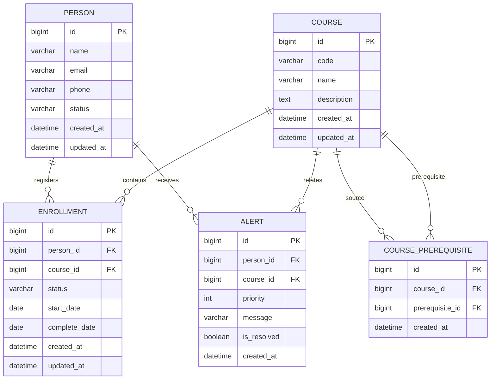

# 中心營運分析系統 - Database Design

## 1. Database Design Goal

資料庫負責：

- 永久保存業務資料
- 管理資料關係
- 提供 Service 查詢來源


資料結構負責：

- 記憶體中的快速操作
- 演算法分析


---

# 2. ERD



---

# 3. Table Specification


# persons

用途：

保存學員資料。


| Column | Type | Constraint |
|-|-|-|
| id | BIGINT | PK |
| name | VARCHAR(50) | NOT NULL |
| email | VARCHAR(100) | UNIQUE, NOT NULL |
| phone | VARCHAR(20) | |
| status | VARCHAR(20) | NOT NULL, DEFAULT ACTIVE |
| created_at | DATETIME | NOT NULL |
| updated_at | DATETIME | NOT NULL |


---

# courses

用途：

保存課程資料。


| Column | Type | Constraint |
|-|-|-|
| id | BIGINT | PK |
| code | VARCHAR(50) | UNIQUE, NOT NULL |
| name | VARCHAR(100) | NOT NULL |
| description | TEXT | |
| created_at | DATETIME | NOT NULL |
| updated_at | DATETIME | NOT NULL |


---

# enrollments

用途：

表示 Person 與 Course 關係。


Relationship:

```text
Person 1 : N Enrollment

Course 1 : N Enrollment
```


| Column | Type | Constraint |
|-|-|-|
| id | BIGINT | PK |
| person_id | BIGINT | FK, NOT NULL |
| course_id | BIGINT | FK, NOT NULL |
| status | VARCHAR(30) | NOT NULL, DEFAULT NOT_STARTED |
| start_date | DATE | |
| complete_date | DATE | |
| created_at | DATETIME | NOT NULL |
| updated_at | DATETIME | NOT NULL |

Constraints:

- `UNIQUE(person_id, course_id)`：避免同一學員重複註冊同一課程
- 刪除 Person 或 Course 時，相關 Enrollment 一併刪除
- 狀態只允許向前轉換（`NOT_STARTED` 可轉為 `IN_PROGRESS` 或 `COMPLETED`，`IN_PROGRESS` 可轉為 `COMPLETED`）；`COMPLETED` 不可回退或再次修改，此規則由 Service 驗證


---

# course_prerequisites

用途：

建立 Course Graph。


例如：

```text
Algorithm

requires

Data Structure
```


| Column | Type | Constraint |
|-|-|-|
| id | BIGINT | PK |
| course_id | BIGINT | FK, NOT NULL |
| prerequisite_id | BIGINT | FK, NOT NULL |
| created_at | DATETIME | NOT NULL |

Constraints:

- `UNIQUE(course_id, prerequisite_id)`：避免重複先修關係
- `course_id <> prerequisite_id`：禁止課程將自己設為先修課程
- 新增關係前由 Course Graph 檢查不得形成 Cycle
- 刪除 Course 時，相關先修關係一併刪除

Graph 邊的方向統一定義為：

```text
prerequisite_id → course_id
```

即「先修課程指向依賴它的課程」。


---

# alerts

用途：

保存課程警示。


| Column | Type | Constraint |
|-|-|-|
| id | BIGINT | PK |
| person_id | BIGINT | FK, NOT NULL |
| course_id | BIGINT | FK, nullable |
| priority | INT | NOT NULL, 1–3 |
| message | VARCHAR(255) | NOT NULL |
| is_resolved | BOOLEAN | NOT NULL, DEFAULT FALSE |
| created_at | DATETIME | NOT NULL |

刪除 Person 時相關 Alert 一併刪除；刪除 Course 時保留 Alert，並將 `course_id` 設為 `NULL`。

Priority 定義：

| Value | Meaning |
|-:|-|
| 3 | HIGH，需立即處理 |
| 2 | MEDIUM，需要追蹤 |
| 1 | LOW，一般提醒 |

`priority` 是 Alert 建立時保存的事件快照。`MaxHeap` 只負責排序，不負責計算 priority。


---

# 4. JPA Relationship Design


## Enrollment

```java
@ManyToOne(fetch = FetchType.LAZY, optional = false)
@JoinColumn(name = "person_id", nullable = false)
private Person person;

@ManyToOne(fetch = FetchType.LAZY, optional = false)
@JoinColumn(name = "course_id", nullable = false)
private Course course;
```


---

## CoursePrerequisite

```java
@ManyToOne(fetch = FetchType.LAZY, optional = false)
@JoinColumn(name = "course_id", nullable = false)
private Course course;

@ManyToOne(fetch = FetchType.LAZY, optional = false)
@JoinColumn(name = "prerequisite_id", nullable = false)
private Course prerequisite;
```


---

## Alert

```java
@ManyToOne(fetch = FetchType.LAZY, optional = false)
@JoinColumn(name = "person_id", nullable = false)
private Person person;

@ManyToOne(fetch = FetchType.LAZY)
@JoinColumn(name = "course_id")
private Course course;
```


---

為控制 MVP 複雜度，Person 與 Course 不建立反向 `@OneToMany` 集合。關聯資料由 Repository 查詢，避免不必要的雙向關聯、循環參照與意外載入大量資料。


---

# 5. Enum Design


## PersonStatus

```text
ACTIVE

INACTIVE
```


---

## EnrollmentStatus

```text
NOT_STARTED

IN_PROGRESS

COMPLETED
```


---

# 6. Index Design


`persons.email` 與 `courses.code` 的 `UNIQUE` 約束已建立唯一索引，不另外建立重複索引。

其餘索引：

| Index | Column | Purpose |
|-|-|-|
| idx_enrollment_person | enrollments.person_id | 查詢學員學習紀錄 |
| idx_enrollment_course | enrollments.course_id | 查詢課程註冊紀錄 |
| idx_cp_course | course_prerequisites.course_id | 查詢課程先修需求 |
| idx_cp_prerequisite | course_prerequisites.prerequisite_id | 建立先修課程 Graph |
| idx_alert_priority | alerts.priority | 依警示優先級排序 |
| idx_alert_person | alerts.person_id | 查詢學員警示 |


---

# 7. Data Validation


## Person

檢查：

- Email 格式
- Email 重複


---

## Course

檢查：

- 課程代碼不可重複
- 名稱不可為空


---

## Enrollment

檢查：

- 同一人不可重複註冊同課程
- `NOT_STARTED` 可轉為 `IN_PROGRESS` 或 `COMPLETED`
- `IN_PROGRESS` 只能轉為 `COMPLETED`
- `COMPLETED` 紀錄不可再修改


---

# 8. Demo Sample Data


目前 `database/sample_data.sql` 提供：

| Data | Count |
|-|-:|
| Person | 200 |
| Course | 20 |
| Enrollment | 1000 |
| Course Prerequisite | 7 |
| Alert | 30 |

此資料量足以展示人員與課程查詢、註冊狀態、Dashboard 統計、Course Graph 與 Alert Priority Queue。

目前 30 筆 Alert 是可重複載入的 Demo seed data，message 與 priority 均由 SQL 預先指定，並非由 Enrollment 自動分析產生。

目標 MVP 由 Alert Generator 掃描 Enrollment 並建立或更新警示，採用不擴充 schema 的確定性規則：

| Enrollment condition | Alert priority |
|-|-:|
| `IN_PROGRESS` 且開始已滿 90 天 | 3 |
| `IN_PROGRESS` 且開始已滿 30 天、未滿 90 天 | 2 |
| `NOT_STARTED` | 1 |
| `COMPLETED` | 不產生警示 |

Alert Generator 負責判斷是否產生警示及 priority；自訂 MaxHeap 接收已判定的 Alert 並提供優先順序。若未來加入期限或最後活動時間，再以 `due_date`／`last_activity_at` 取代目前依 `start_date` 推導的 MVP 規則。


## Graph Data

正常：

```text
Java
 ↓
OOP
 ↓
Data Structure
 ↓
Algorithm
```


Cycle Detection 的負向測試情境：

```text
A
↓
B
↓
C
↓
A
```

循環資料不寫入正式 Sample Data，由 Service 測試建立並確認系統拒絕該關係。


---

# 9. Normalization and MVP Decision

目前 schema 符合 MVP 所需的第三正規化（3NF）：

- Person 與 Course 各自保存單一主題資料
- 多對多的註冊關係拆分為 enrollments，進度狀態與日期依附於 Enrollment
- 課程先修關係拆分為 course_prerequisites，支援一門課有多個先修課程
- Alert 作為事件快照保存 priority 與 message，適合 Demo 排序與通知展示

MVP 不加入權限、分類、稽核歷程或額外統計資料表，分析結果由 Service 即時計算，避免過度設計。
