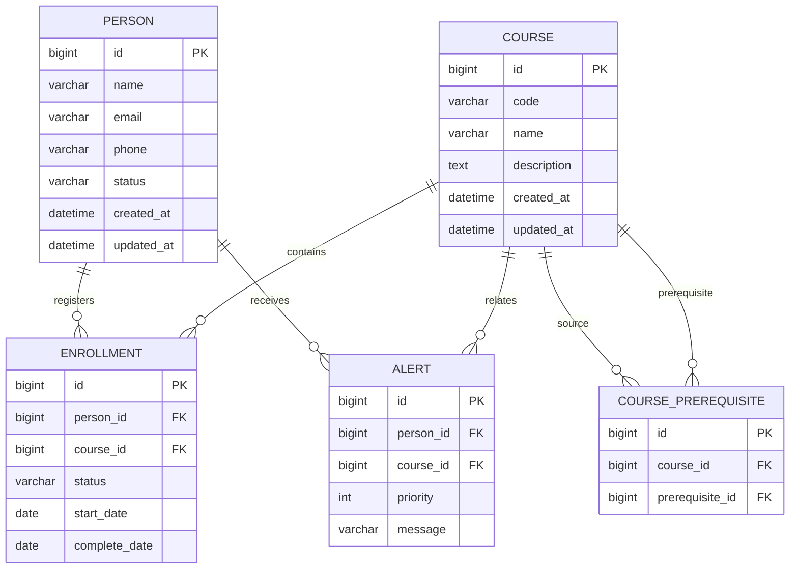

# 中心營運分析系統 - Database Design

## 1. Database Design Goal

資料庫負責：

- 永久保存業務資料
- 管理資料關係
- 提供 Service 查詢來源


資料結構負責：

- 記憶體中的快速操作
- 演算法分析


---

# 2. ERD



---

# 3. Table Specification


# PERSON

用途：

保存學員資料。


| Column | Type | Constraint |
|-|-|-|
| id | BIGINT | PK |
| name | VARCHAR(50) | NOT NULL |
| email | VARCHAR(100) | UNIQUE |
| phone | VARCHAR(20) | |
| status | VARCHAR(20) | |
| created_at | DATETIME | |
| updated_at | DATETIME | |


---

# COURSE

用途：

保存課程資料。


| Column | Type | Constraint |
|-|-|-|
| id | BIGINT | PK |
| code | VARCHAR(50) | UNIQUE |
| name | VARCHAR(100) | NOT NULL |
| description | TEXT | |
| created_at | DATETIME | |
| updated_at | DATETIME | |


---

# ENROLLMENT

用途：

表示 Person 與 Course 關係。


Relationship:

```text
Person 1 : N Enrollment

Course 1 : N Enrollment
```


| Column | Type | Constraint |
|-|-|-|
| id | BIGINT | PK |
| person_id | BIGINT | FK |
| course_id | BIGINT | FK |
| status | VARCHAR(30) | |
| start_date | DATE | |
| complete_date | DATE | |


---

# COURSE_PREREQUISITE

用途：

建立 Course Graph。


例如：

```text
Algorithm

requires

Data Structure
```


| Column | Type |
|-|-|
| id | BIGINT |
| course_id | BIGINT |
| prerequisite_id | BIGINT |


---

# ALERT

用途：

保存課程警示。


| Column | Type |
|-|-|
| id | BIGINT |
| person_id | BIGINT |
| course_id | BIGINT |
| priority | INT |
| message | VARCHAR(255) |


---

# 4. JPA Relationship Design


## Person

```java
@OneToMany(
mappedBy = "person"
)
private List<Enrollment> enrollments;
```


---

## Enrollment

```java
@ManyToOne
private Person person;


@ManyToOne
private Course course;
```


---

## Course

```java
@OneToMany(
mappedBy = "course"
)
private List<Enrollment> enrollments;
```


---

# 5. Enum Design


## PersonStatus

```text
ACTIVE

INACTIVE
```


---

## EnrollmentStatus

```text
NOT_STARTED

IN_PROGRESS

COMPLETED
```


---

# 6. Index Design


## Person Email Index

用途：

快速查詢使用者。


```sql
CREATE INDEX idx_person_email
ON person(email);
```


---

## Course Code Index

用途：

快速查詢課程代碼。


```sql
CREATE INDEX idx_course_code
ON course(code);
```


---

## Enrollment Person Index

用途：

查詢個人學習紀錄。


```sql
CREATE INDEX idx_enrollment_person
ON enrollment(person_id);
```


---

# 7. Data Validation


## Person

檢查：

- Email 格式
- Email 重複


---

## Course

檢查：

- 課程代碼不可重複
- 名稱不可為空


---

## Enrollment

檢查：

- 同一人不可重複註冊同課程
- 狀態轉換合理


---

# 8. Sample Data 規劃


開發測試資料：

## Person

50 筆以上


## Course

10~20 筆


## Enrollment

100 筆以上


## Graph Data

正常：

```text
Java
 ↓
OOP
 ↓
Data Structure
 ↓
Algorithm
```


異常：

```text
A
↓
B
↓
C
↓
A
```

用於測試 Cycle Detection。