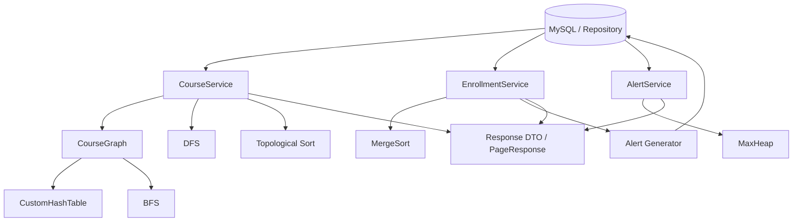
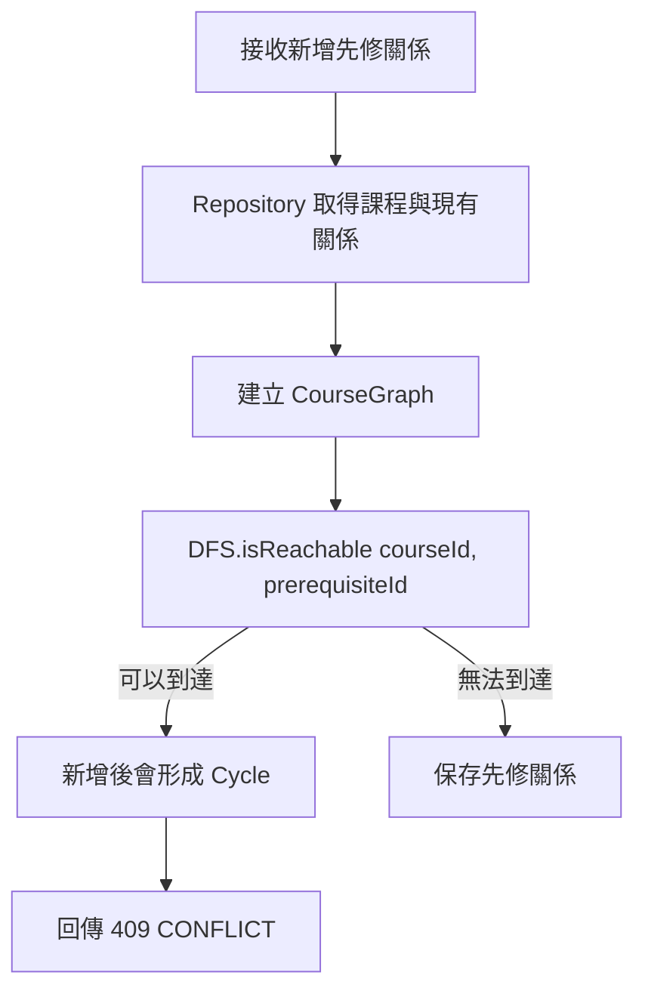

# 資料結構與演算法模組總覽

> 本文件是組員理解、系統展示與口頭答辯的入口。各元件的逐行程式解說、圖形變化與更多問答，請由文末連結進入個別指南。

## 1. 模組目標

本專案不是只建立幾個獨立演算法類別，而是讓核心資料結構與演算法實際參與系統功能：

```text
課程先修關係 ──► CourseGraph + DFS + Topological Sort
警示產生與查詢 ─► Alert Generator + MaxHeap
學習紀錄排序 ───► MergeSort
圖形走訪展示 ───► BFS + DFS
圖形內部查詢 ───► CustomHashTable
```

設計原則：

- 資料結構只管理資料，不包含 Spring、Repository 或業務規則。
- 演算法保持 stateless，由呼叫端傳入資料。
- Service 負責把 Entity 轉成演算法需要的輸入，再把結果轉成 DTO。
- Controller 只依賴 Service Interface，既有 API 契約不因演算法整合而改變。
- 排序與篩選必須在分頁前處理完整條件結果，不能只排序前端目前載入的一頁。

---

## 2. 完成項目與系統角色

| 元件 | 類型 | 解決的問題 | 實際整合位置 |
|-|-|-|-|
| `CustomHashTable<K,V>` | 資料結構 | 以 key 快速取得 value | CourseGraph、BFS、DFS、Topological Sort |
| `CourseGraph<T>` | 資料結構 | 表示「先修課程 → 依賴課程」關係 | CourseService |
| `MaxHeap<T>` | 資料結構 | 快速取出最高優先級資料 | AlertService |
| `BreadthFirstSearch` | 演算法 | 從起點逐層走訪圖形 | 獨立展示與單元測試 |
| `DepthFirstSearch` | 演算法 | 深入走訪及判斷兩點是否可達 | 新增先修關係的 Cycle 檢查 |
| `TopologicalSort` | 演算法 | 產生符合先修限制的順序 | Learning Path API |
| `MergeSort` | 演算法 | 以穩定的 `O(n log n)` 排序完整結果 | EnrollmentService 課程名稱排序 |
| `AlertGenerator` | 分析／業務規則 | 依修課狀態與日期決定警示及 priority | Enrollment 新增與狀態更新流程 |

目前 MVP 規格內的所有資料結構與演算法均已完成。BFS 沒有額外 API，因為現有 Learning Path API 的契約只需要節點、邊與拓樸順序；BFS 保留為可獨立執行與答辯的圖形走訪演算法。

---

## 3. 模組目錄

```text
src/main/java/com/centerops/
├── datastructure/
│   ├── CustomHashTable.java
│   ├── CourseGraph.java
│   └── MaxHeap.java
├── algorithm/
│   ├── BreadthFirstSearch.java
│   ├── DepthFirstSearch.java
│   ├── TopologicalSort.java
│   └── MergeSort.java
└── analytics/
    └── AlertGenerator.java
```

應用層整合位置：

```text
service/impl/
├── CourseServiceImpl.java       ← Graph、DFS、Topological Sort
├── AlertServiceImpl.java        ← MaxHeap
└── EnrollmentServiceImpl.java   ← Alert Generator、MergeSort
```

---

## 4. 整體依賴關係



重要責任邊界：

- `CourseGraph` 保存節點與邊，不決定 HTTP status。
- DFS 判斷可達性，不直接新增或刪除資料庫關係。
- Alert Generator 決定 priority，MaxHeap 不計算 priority。
- MergeSort 只接受 List 與 Comparator，不認識 Enrollment DTO 或 Repository。
- Service 決定何時呼叫演算法，並處理例外與分頁。

---

## 5. 功能流程一：課程先修圖

### 5.1 Graph 的方向

所有邊統一定義為：

```text
先修課程 ──► 依賴該先修課程的課程
```

例如：

```text
Java Basic ──► Object Oriented Programming ──► Data Structure
```

代表必須先學 Java Basic，才能學 OOP；完成 OOP 後才能學 Data Structure。

### 5.2 新增先修關係與 Cycle 檢查

假設使用者要新增：

```text
prerequisiteId ──► courseId
```

Service 會先檢查目前是否已存在反方向路徑：

```text
courseId ──► ... ──► prerequisiteId
```

流程：



例如目前已有：

```text
A ──► B ──► C
```

若再加入 `C ──► A`，DFS 能從 A 走到 C，表示新邊會封閉成環：

```text
A ──► B ──► C
▲             │
└─────────────┘
```

### 5.3 Learning Path

相關 API：

```http
GET /api/courses/learning-path
```

處理流程：

```text
Course + CoursePrerequisite Repository
→ 建立 CourseGraph
→ TopologicalSort.sort(graph)
→ CourseGraphResponse(nodes, edges, topologicalOrder)
```

`topologicalOrder` 是「一組符合先修限制的可行順序」。相鄰的兩門課不一定有直接先修關係，因此前端不能用單一連續箭頭把所有課程畫成一條鏈。

### 5.4 BFS 與 DFS 的差異

```text
BFS：一層一層向外找，使用 Queue
DFS：沿一條路徑走到底，再回頭，使用遞迴
```

本專案以 DFS 的可達性判斷 Cycle。BFS 保留完整實作與測試，可在報告中展示不同圖形走訪策略，但不額外擴充 API。

---

## 6. 功能流程二：自動警示與優先級

### 6.1 Alert Generator 規則

| Enrollment 條件 | 結果 |
|-|-|
| `NOT_STARTED` | priority 1 |
| `IN_PROGRESS` 未滿 30 天 | 不產生警示 |
| `IN_PROGRESS` 滿 30 天、未滿 90 天 | priority 2 |
| `IN_PROGRESS` 滿 90 天 | priority 3 |
| `COMPLETED` | 不產生警示 |

Generator 在下列操作成功保存 Enrollment 後執行：

```http
POST /api/enrollments
PUT /api/enrollments/{id}
```

```text
保存 Enrollment
→ AlertGenerator.synchronize(enrollment)
→ 建立、更新或移除 [AUTO] Alert
→ 回傳 EnrollmentResponse
```

自動警示使用 `[AUTO] ` 訊息前綴識別，避免修改 `sample_data.sql` 的 Demo Alert。這是目前不擴充資料庫 schema 的 MVP 方案。

### 6.2 MaxHeap 排序

相關 API：

```http
GET /api/alerts?page=0
GET /api/alerts?page=0&priority=3
```

處理順序：

```text
Repository 取得完整篩選結果
→ 將每筆 Alert 插入 MaxHeap
→ 反覆 remove root 取得全域順序
→ 切出每頁 10 筆
→ AlertResponse
```

比較規則：

```text
1. priority DESC
2. createdAt ASC
3. id ASC
```

必須先排序完整結果再分頁。如果先由資料庫切出 10 筆才放入 Heap，只能保證單頁內部順序，無法保證下一頁沒有更高 priority。

### 6.3 Generator 與 Heap 為什麼分開？

```text
Alert Generator：判斷「這筆資料應不應該警示、priority 是多少」
MaxHeap：判斷「已產生的警示誰先出現」
```

若把規則寫進 Heap，Heap 就只能排序 Alert，無法成為泛型可重用資料結構，也無法獨立測試 Heap Property。

---

## 7. 功能流程三：學習紀錄排序

相關 API 契約維持不變：

```http
GET /api/enrollments?page=0
GET /api/enrollments?page=0&sort=courseName&direction=asc
GET /api/people/{personId}/enrollments?page=0&sort=courseName&direction=desc
```

採取最小影響整合：

```text
未指定 sort
→ Repository 依 enrollment id ASC 排序與分頁

sort=courseName
→ Repository 取得完整條件結果
→ MergeSort.sort(List<Enrollment>, Comparator)
→ 切出每頁 10 筆
→ EnrollmentResponse
```

Comparator 規則：

```text
第一條件：course.name，不分英文字母大小寫，方向依 asc / desc
第二條件：enrollment.id ASC
```

同名課程固定以 id 升序，使分頁結果具有決定性，不會因資料庫回傳順序不同而漂移。

### 為什麼保留兩個 MergeSort overload？

```java
int[] sort(int[] values)

<T> List<T> sort(List<T> values, Comparator<? super T> comparator)
```

- `int[]` 版本最容易展示 Divide and Conquer 與 merge 過程。
- 泛型版本能依課程名稱真正排序 Enrollment。
- 兩者都建立副本，不修改呼叫端傳入的資料。
- 合併時相等會先取左半元素，因此維持 Stable Sort。

---

## 8. 公開方法速查

### CustomHashTable

| 方法 | 用途 |
|-|-|
| `put(key, value)` | 新增或更新 key-value |
| `get(key)` | 取得 value |
| `containsKey(key)` | 判斷 key 是否存在 |
| `remove(key)` | 移除並回傳 value |
| `size()` | 取得元素數量 |

### CourseGraph

| 方法 | 用途 |
|-|-|
| `addVertex(vertex)` | 新增節點 |
| `addEdge(prerequisite, dependent)` | 新增先修方向邊 |
| `containsVertex(vertex)` | 判斷節點是否存在 |
| `containsEdge(from, to)` | 判斷邊是否存在 |
| `vertices()` | 取得所有節點 |
| `neighborsOf(vertex)` | 取得相鄰節點 |
| `indegreeOf(vertex)` | 取得入度 |
| `vertexCount()` | 取得節點數 |
| `edgeCount()` | 取得邊數 |

### MaxHeap

| 方法 | 用途 |
|-|-|
| `insert(value)` | 插入並向上恢復 Heap Property |
| `peek()` | 查看最大元素，不移除 |
| `remove()` | 取出最大元素並向下恢復 Heap Property |
| `size()` | 取得元素數量 |
| `isEmpty()` | 判斷是否為空 |

### Algorithm 與 Analytics

| 方法 | 用途 |
|-|-|
| `BreadthFirstSearch.traverse(graph, start)` | BFS 走訪順序 |
| `DepthFirstSearch.traverse(graph, start)` | DFS 走訪順序 |
| `DepthFirstSearch.isReachable(graph, start, target)` | 判斷兩點是否可達 |
| `TopologicalSort.sort(graph)` | 取得拓樸順序 |
| `TopologicalSort.hasCycle(graph)` | 判斷 Graph 是否有 Cycle |
| `MergeSort.sort(int[])` | 排序整數陣列 |
| `MergeSort.sort(List, Comparator)` | 依比較規則排序物件 |
| `AlertGenerator.synchronize(enrollment)` | 同步 Enrollment 的自動警示 |

---

## 9. 複雜度總表

符號：`n` 為元素數，`V` 為節點數，`E` 為邊數，`d` 為單一節點的鄰接數。

| 操作 | 平均／一般時間 | 最壞時間 | 額外空間 |
|-|-:|-:|-:|
| HashTable `put/get/remove` | `O(1)` | `O(n)` | `O(n)` |
| CourseGraph `addVertex` | `O(1)` | `O(V)` | `O(1)` |
| CourseGraph `addEdge` | `O(d)` | `O(E)` | `O(1)` |
| BFS | `O(V + E)` | `O(V + E)` | `O(V)` |
| DFS | `O(V + E)` | `O(V + E)` | `O(V)` |
| Topological Sort | `O(V + E)` | `O(V + E)` | `O(V)` |
| MaxHeap `peek` | `O(1)` | `O(1)` | `O(1)` |
| MaxHeap `insert/remove` | `O(log n)` | `O(log n)` | `O(1)` |
| MergeSort | `O(n log n)` | `O(n log n)` | `O(n)` |
| Alert 規則判斷 | `O(1)` | `O(1)` | `O(1)` |

HashTable 最壞情況發生在大量 key 落入相同 bucket，必須沿 collision chain 逐筆搜尋。

---

## 10. Java 集合框架的使用界線

本專案展示的是三個核心自訂結構：HashTable、Graph 與 MaxHeap，不是重新實作 Java 標準函式庫的每一種容器。

- Graph 的主要 key-value 儲存使用 `CustomHashTable`。
- Heap 的 complete binary tree 使用自訂陣列邏輯。
- BFS 可使用 Queue，DFS 可使用 recursion，DTO 可使用 List。
- Repository 與 Spring Data 回傳的 List、Page 不需要自行取代。

如此能清楚展示課程要求的核心概念，同時避免把 Spring Boot 應用層改成難以維護的自製集合框架。

---

## 11. API 相容性

演算法整合沒有新增或移除 endpoint，也沒有修改 Request／Response DTO。前端原本的呼叫方式保持不變。

行為上的改進：

- 新增先修關係會由 DFS 阻擋 Cycle。
- Learning Path 回傳有效拓樸順序。
- Enrollment 課程名稱排序會正確套用到完整結果後再分頁。
- Enrollment 新增或更新後可能自動建立、更新或移除警示。
- Alert 清單由 MaxHeap 依全域 priority 順序回傳。

前端若希望立即顯示新的自動警示，可在 Enrollment 寫入成功後重新抓取 Alert；這是畫面刷新策略，不是 API 契約變更。

---

## 12. 建議 Demo 流程

### Demo A：Cycle 防護

1. 顯示目前課程先修關係。
2. 新增一筆不會形成 Cycle 的先修關係，確認成功。
3. 嘗試加入反向關係使 Graph 成環。
4. 確認 Backend 回傳 `409 CONFLICT`。
5. 說明 DFS 如何先檢查 `courseId` 是否能到達 `prerequisiteId`。

### Demo B：Learning Path

1. 呼叫 `GET /api/courses/learning-path`。
2. 顯示 `nodes` 與 `edges`。
3. 顯示 `topologicalOrder`。
4. 選一條 edge，確認 prerequisite 位於 dependent 之前。
5. 說明拓樸排序不是唯一答案，也不是單一路徑。

### Demo C：MergeSort 與跨頁排序

1. 呼叫 `GET /api/enrollments?page=0&sort=courseName&direction=asc`。
2. 切換到下一頁，確認順序延續而不是重新從 A 開始。
3. 改為 `direction=desc` 並回到 page 0。
4. 說明 Backend 先排序完整條件結果，再切每頁 10 筆。

### Demo D：Alert Generator 與 MaxHeap

1. 新增 `NOT_STARTED` Enrollment，確認產生 priority 1 的 `[AUTO]` Alert。
2. 使用測試資料展示進行滿 30／90 天的 priority 2／3。
3. 將修課設為 `COMPLETED`，確認自動警示被移除。
4. 呼叫 `GET /api/alerts?page=0`，確認 priority 3 位於前面。
5. 使用 `priority=3` 篩選，確認 metadata 反映篩選後資料。

---

## 13. 測試範圍

目前完整 Maven 測試共 81 項，包含：

- 三個自訂資料結構的單元測試。
- BFS、DFS、Topological Sort、MergeSort 單元測試。
- MergeSort 泛型 Comparator、Stable Sort 與不修改輸入測試。
- CourseService Cycle 檢查與 Learning Path 測試。
- Alert Generator 日期邊界與生命週期測試。
- MaxHeap 全域排序後分頁測試。
- Enrollment 全域排序、個人篩選、direction、tie-breaker 與分頁測試。
- Controller、Service 與 Spring Application Context 回歸測試。

測試指令：

```bash
./mvnw test
```

---

## 14. MVP 取捨與限制

### Alert 不會因時間經過自動升級

Generator 在 Enrollment 新增或更新時執行。如果資料沒有任何寫入，即使日期跨過 30／90 天也不會自行重算。正式擴充可加入每日排程批次同步。

### 自動警示以 message 前綴識別

目前沒有 `alert_source` 或 `enrollment_id` 欄位，因此使用 `[AUTO]`。正式系統應增加明確來源欄位與唯一約束。

### Heap 與 MergeSort 會載入完整條件結果

這是為了展示自訂演算法並確保全域排序後才分頁，適合目前約 1000 筆 Enrollment 的 MVP。大型正式系統應優先使用資料庫索引、排序及分頁。

### BFS 沒有 API

BFS 已完成且可獨立測試，但現有產品畫面不需要 BFS 結果，因此不為了展示而擴充額外 endpoint。

### Topological Order 不唯一

只要每條邊的 prerequisite 都出現在 dependent 之前，就是合法結果。不同合法順序不代表演算法錯誤。

---

## 15. 建議答辯分工

| 主題 | 報告重點 |
|-|-|
| HashTable | bucket、hash、collision、load factor、resize |
| Graph | adjacency list、邊方向、vertex／edge |
| BFS／DFS | Queue 與 recursion 的走訪差異、可達性 |
| Topological Sort | indegree、Kahn's Algorithm、Cycle |
| MaxHeap | Complete Binary Tree、moveUp、moveDown、Comparator |
| MergeSort | Divide and Conquer、merge、Stable Sort、`O(n log n)` |
| Alert Generator | 業務規則與資料結構責任分離 |
| 系統整合 | Repository → Service → Algorithm → DTO，排序後再分頁 |

每位組員至少需要理解整體資料流，再深入負責的 1–2 個元件。不要只背複雜度，應能用一組小資料畫出結構如何變化。

---

## 16. 常見整合答辯問題

### Q1：為什麼不全部交給資料庫排序？

正式大型系統通常應交給資料庫。本專案是資料結構與演算法課程的 MVP，資料量可控，因此在指定功能中使用自訂 MaxHeap 與 MergeSort 展示實際整合；文件也明確記錄其規模限制。

### Q2：為什麼 Controller 不直接呼叫演算法？

Controller 只負責 HTTP 輸入輸出。Service 才知道如何從 Repository 取得完整資料、建立 Graph、處理 transaction 與轉換 DTO，這能維持分層架構並讓演算法獨立測試。

### Q3：為什麼 MaxHeap 不負責計算 priority？

Priority 是會改變的業務規則，Heap 是通用排序結構。使用 Comparator 後，Heap 不需要認識 Alert，也能排序其他物件。

### Q4：如何證明先修關係沒有 Cycle？

新增 `prerequisite → course` 前，使用 DFS 檢查目前是否已存在 `course → ... → prerequisite` 路徑；若存在，加入新邊就會閉合成環，因此拒絕寫入。

### Q5：為什麼 Topological Sort 結果不一定和畫面上的箭頭完全相鄰？

拓樸排序只保證先後限制。兩個相鄰項目可能沒有直接 edge，平行分支也可以交換位置。

### Q6：如何確保排序分頁正確？

先對完整的篩選結果執行 Heap 或 MergeSort，再計算 `fromIndex`、`toIndex` 切出指定頁面。測試使用超過 10 筆資料驗證跨頁順序。

### Q7：為什麼 MergeSort 是 Stable Sort？

合併時若 Comparator 判斷相等，程式先取左半元素，因此相同 key 的原始相對順序不變。本專案另外以 enrollment id 作 tie-breaker，讓 API 結果更具決定性。

### Q8：前端需要因演算法模組修改 API 嗎？

不需要。Endpoint、query parameters 與 DTO 均保持相容；前端只會看到排序、Cycle 防護與自動警示行為變得完整。

---

## 17. 詳細文件索引

### 資料結構

- [CustomHashTable 完整說明](data_structure_guides/01_custom_hash_table.md)
- [CourseGraph 完整說明](data_structure_guides/02_course_graph.md)
- [MaxHeap 完整說明](data_structure_guides/03_max_heap.md)

### 演算法

- [BFS 完整說明](algorithm_guides/01_breadth_first_search.md)
- [DFS 完整說明](algorithm_guides/02_depth_first_search.md)
- [Topological Sort 完整說明](algorithm_guides/03_topological_sort.md)
- [MergeSort 完整說明](algorithm_guides/04_merge_sort.md)

### 分析規則

- [Alert Generator 完整說明](analytics_guides/01_alert_generator.md)

### 系統規格

- [專案範圍](01_project_scope.md)
- [API 規格](03_api_spec.md)
- [專案架構](04_project_architecture.md)
- [測試策略](06_test_strategy.md)

---

## 18. 一分鐘總結

> 本專案自訂 HashTable、CourseGraph 與 MaxHeap，並實作 BFS、DFS、Topological Sort 與 MergeSort。
> CourseGraph 表示先修關係，DFS 在新增關係前檢查 Cycle，Topological Sort 產生建議修課順序；Alert Generator
> 依 Enrollment 狀態決定 priority，再由 MaxHeap 排序；MergeSort 負責學習紀錄的課程名稱全域排序。
> 所有演算法與 Spring 分層分離，由 Service 整合 Repository、Algorithm 與 DTO，既有 API 契約保持不變。
