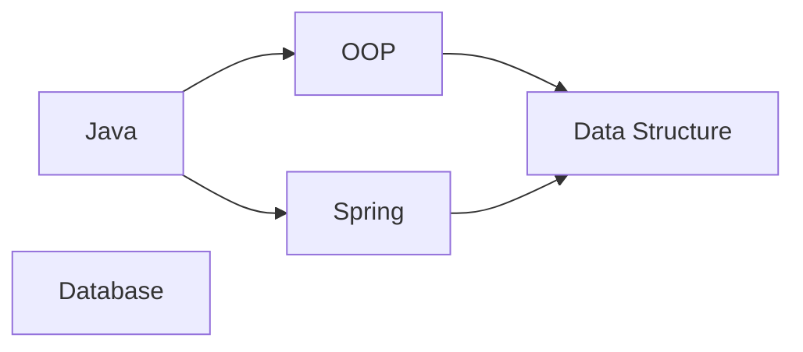
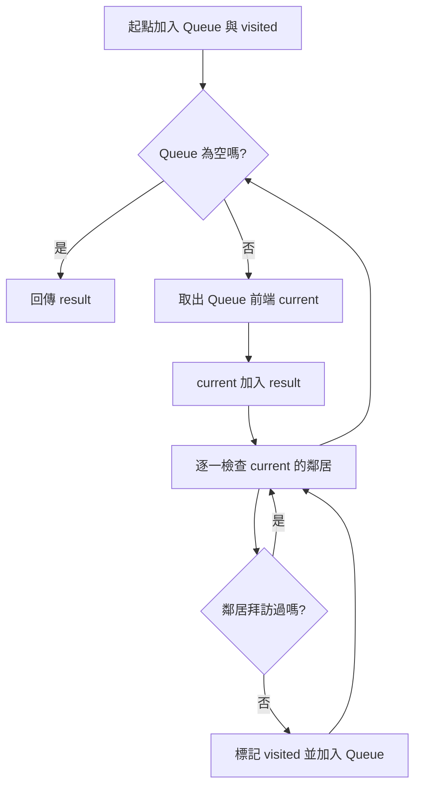
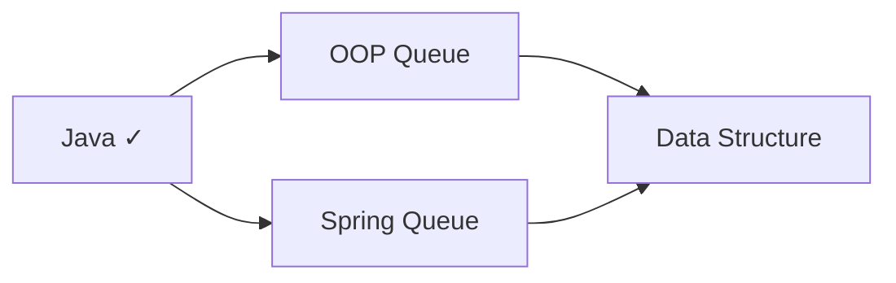
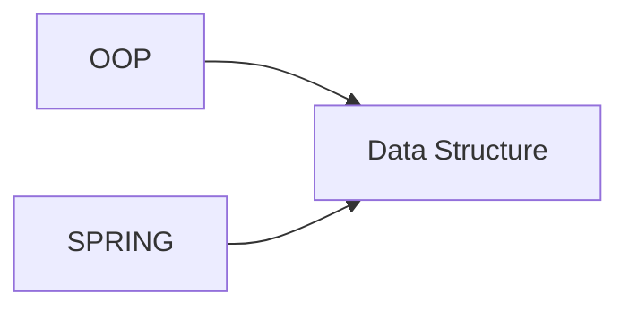

# Breadth-First Search（BFS）完整說明

> 對應程式：`src/main/java/com/centerops/algorithm/BreadthFirstSearch.java`

## 1. BFS 要解決什麼問題？

Breadth-First Search，中文常稱「廣度優先搜尋」，會先走訪距離起點最近的所有節點，再往下一層移動。

本專案可以用 BFS 回答：

- 從某門基礎課程出發，能直接或間接連到哪些後續課程？
- 哪些課程距離起點只有一條邊？
- 如何逐層展示課程依賴關係？

BFS 的核心工具是 Queue，遵守 First In, First Out（FIFO）：先加入 Queue 的節點會先被處理。

---

## 2. 使用的範例圖

邊固定代表「先修課程 → 依賴課程」：



Adjacency List：

```text
Java           → [OOP, Spring]
OOP            → [Data Structure]
Spring         → [Data Structure]
Data Structure → []
Database       → []
```

從 Java 開始的 BFS 結果：

```text
Java → OOP → Spring → Data Structure
```

Database 與 Java 不連通，因此不會出現在結果中。

---

## 3. 類別為什麼是 Stateless Utility Class？

```java
public final class BreadthFirstSearch {

    private BreadthFirstSearch() {
    }
}
```

- `final`：避免建立沒有意義的子類別。
- private constructor：不允許 `new BreadthFirstSearch()`。
- static method：直接使用 `BreadthFirstSearch.traverse(...)`。
- 每次呼叫都建立自己的 queue、visited 與 result，不保存共用狀態。

這讓演算法可獨立測試，也不依賴 Spring、Controller 或 Repository。

---

## 4. 公開方法

| 方法 | 用途 | 回傳值 | 可能例外 | 複雜度 |
|---|---|---|---|---:|
| `traverse(CourseGraph<T>, T start)` | 從起點逐層走訪可到達節點 | 不可修改的走訪結果 | null 時 `NullPointerException`；起點不存在時 `IllegalArgumentException` | `O(V + E)` |

這裡的 V 與 E 只計算從 start 能到達的頂點與邊。

---

## 5. 三個執行中資料

```java
List<T> result = new ArrayList<>();
Queue<T> queue = new ArrayDeque<>();
CustomHashTable<T, Boolean> visited = new CustomHashTable<>();
```

### `result`

保存最後的 BFS 走訪順序。

### `queue`

保存「已發現、但尚未處理」的節點。使用 Queue 才能逐層處理。

### `visited`

記錄已經加入 Queue 的節點，避免同一節點重複進入 Queue，也避免 Graph 有 cycle 時無限走訪。

使用自訂 `CustomHashTable<T, Boolean>`，key 代表已拜訪的頂點；Boolean value 在這裡只是標記。

---

## 6. 初始化

```java
queue.add(start);
visited.put(start, true);
```

以 Java 為起點：

```text
queue   = [Java]
visited = {Java}
result  = []
```

起點在開始時就標記 visited，而不是等到取出 Queue 時才標記。

---

## 7. 核心迴圈

```java
while (!queue.isEmpty()) {
    T current = queue.remove();
    result.add(current);

    for (T neighbor : graph.neighborsOf(current)) {
        if (!visited.containsKey(neighbor)) {
            visited.put(neighbor, true);
            queue.add(neighbor);
        }
    }
}
```

每次執行四個步驟：

1. 從 Queue 前端取出 current。
2. 把 current 加入結果。
3. 檢查 current 的所有直接鄰居。
4. 未拜訪的鄰居標記 visited，並加入 Queue 尾端。



---

## 8. 完整圖形變化

### Step 0：初始化

```text
queue   = [Java]
visited = {Java}
result  = []
```

### Step 1：處理 Java

Java 的鄰居是 OOP、Spring：

```text
取出 Java
queue   = []
result  = [Java]

加入 OOP、Spring
queue   = [OOP, Spring]
visited = {Java, OOP, Spring}
```



### Step 2：處理 OOP

```text
取出 OOP
queue  = [Spring]
result = [Java, OOP]

發現 Data Structure
queue   = [Spring, Data Structure]
visited = {Java, OOP, Spring, Data Structure}
```

### Step 3：處理 Spring

Spring 也指向 Data Structure，但它已經在 visited：

```text
取出 Spring
queue  = [Data Structure]
result = [Java, OOP, Spring]

Data Structure 已拜訪，不重複加入 Queue
```

如果沒有 visited，Data Structure 會被加入兩次。

### Step 4：處理 Data Structure

```text
取出 Data Structure
queue  = []
result = [Java, OOP, Spring, Data Structure]
```

Queue 為空，演算法結束。

---

## 9. 為何在「加入 Queue」時就標記 visited？

考慮 OOP 與 Spring 都指向 Data Structure：



如果等到 Data Structure 被取出時才標記：

```text
OOP 處理時：加入 Data Structure
Spring 處理時：又加入 Data Structure
```

Queue 會變成：

```text
[Data Structure, Data Structure]
```

因此正確做法是在 enqueue 時立刻標記，保證每個節點最多進入 Queue 一次。

---

## 10. 驗證起點

```java
Objects.requireNonNull(graph, "graph must not be null");
Objects.requireNonNull(start, "start must not be null");
if (!graph.containsVertex(start)) {
    throw new IllegalArgumentException("Unknown start vertex: " + start);
}
```

不讓錯誤起點靜默回傳空結果，因為「起點不存在」通常代表呼叫端傳錯 Course ID，應該及早發現。

---

## 11. 時間與空間複雜度

每個可達頂點最多：

- 進入 Queue 一次。
- 離開 Queue 一次。
- 加入 result 一次。

每條可達邊最多檢查一次。

```text
時間複雜度：O(V + E)
空間複雜度：O(V)
```

Queue、visited 與 result 最多各保存 V 個節點。

---

## 12. MVP 取捨與限制

- 只走訪 start 可到達的範圍，不自動遍歷 disconnected component。
- 不計算最短路徑距離或保存 parent；目前只回傳走訪順序。
- Queue 使用 Java `ArrayDeque`，因為專題要求自訂的是 HashTable、Graph 與 Heap，沒有要求重寫 Queue。
- 同層順序依 Graph 邊的加入順序決定。
- 回傳 `List.copyOf(result)`，呼叫端不能修改演算法結果。

---

## 13. 常見答辯問題

### Q1：BFS 為什麼使用 Queue？

Queue 先進先出，先發現的近距離節點會先處理，因此能逐層走訪。

### Q2：visited 的用途是什麼？

避免同一頂點由不同路徑重複加入 Queue，也避免 cycle 造成無限迴圈。

### Q3：為什麼 enqueue 時就標記 visited？

因為同一個節點可能被多個父節點指向。立刻標記可以保證每個節點只進 Queue 一次。

### Q4：BFS 會包含 Database 嗎？

從 Java 出發時不會，因為 Database 與 Java 不連通。若要遍歷整張圖，需要針對尚未拜訪的 component 再選新起點。

### Q5：BFS 結果是否只有一種？

不一定。同一層的節點順序會受到 adjacency list 順序影響，但層級關係不變。

### Q6：為什麼不把 BFS 寫進 CourseGraph？

CourseGraph 負責儲存；BFS 負責運算。分離後 Graph 可以被 DFS、Topological Sort 等不同演算法重用。

### Q7：BFS 可以找最短路徑嗎？

在無權重圖中可以。本版本尚未保存距離與前一節點，只實作專題需要的走訪順序。

---

## 14. 最短口頭說明版本

> BFS 使用 Queue 從起點逐層走訪。起點先加入 Queue 並立刻標記 visited；每次取出一個節點後，把尚未拜訪的鄰居加入 Queue。每個頂點與邊最多處理一次，因此時間複雜度是 O(V+E)。
