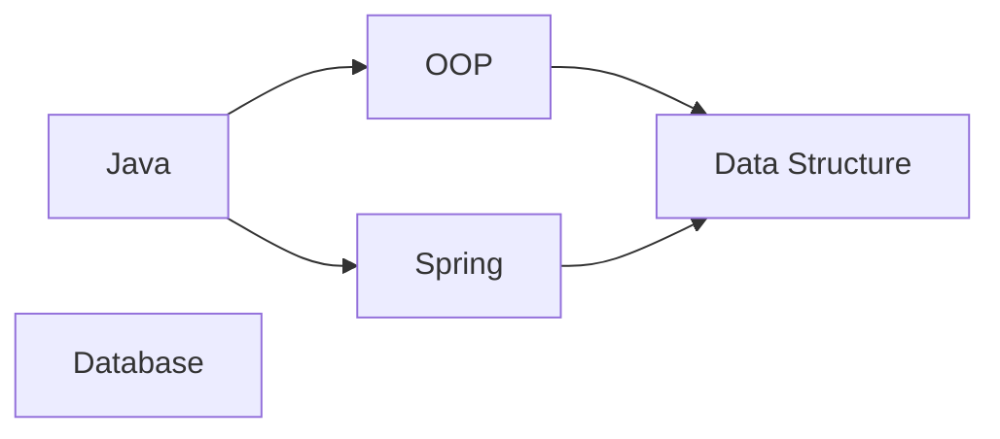
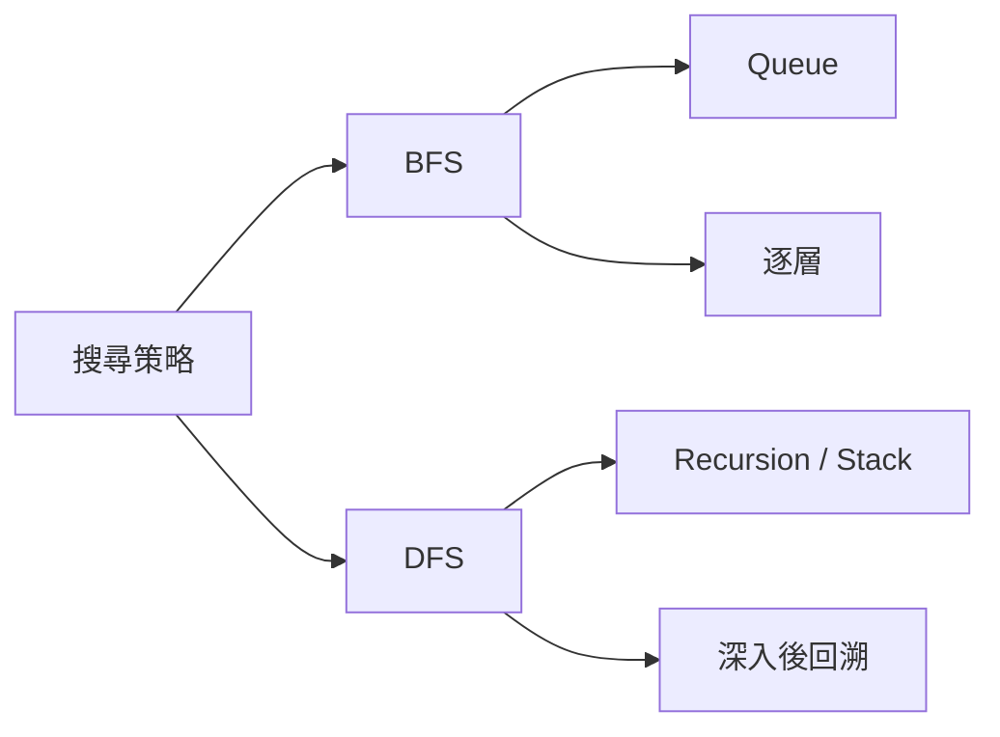
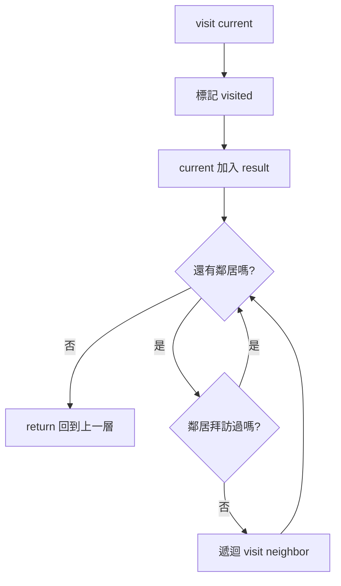
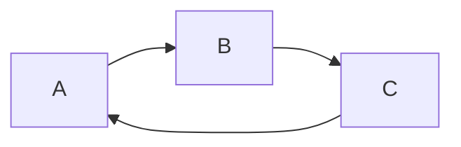
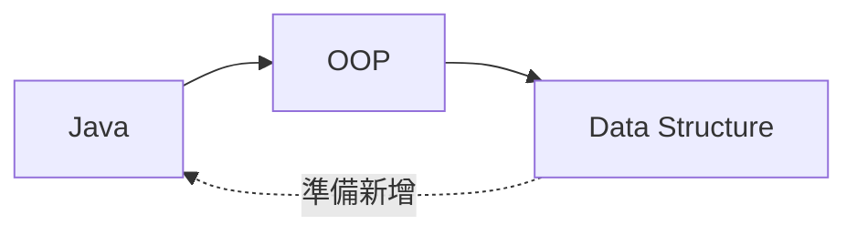

# Depth-First Search（DFS）完整說明

> 對應程式：`src/main/java/com/centerops/algorithm/DepthFirstSearch.java`

## 1. DFS 要解決什麼問題？

Depth-First Search，中文常稱「深度優先搜尋」，會先沿著一條路徑盡可能深入；走到底後再回溯，探索下一條分支。

本專案可以用 DFS：

- 走訪某門課程能到達的後續課程。
- 判斷兩門課程之間是否存在路徑。
- 新增先修關係前，協助判斷是否會形成 cycle。

本版本使用遞迴，Java 的 method call stack 就是 DFS 的 Stack。

---

## 2. 使用的範例圖



從 Java 開始，依照 adjacency list 順序執行 DFS：

```text
Java → OOP → Data Structure → Spring
```

它與 BFS 不同：DFS 先把 OOP 這條路走到底，之後才回來處理 Spring。

---

## 3. BFS 與 DFS 的直覺差異

```text
BFS：先把同一層看完
Java → OOP → Spring → Data Structure

DFS：先把一條路走到底
Java → OOP → Data Structure → Spring
```



---

## 4. Stateless Utility Class

```java
public final class DepthFirstSearch {

    private DepthFirstSearch() {
    }
}
```

演算法沒有物件狀態，直接透過 static methods 使用：

```java
DepthFirstSearch.traverse(graph, start);
DepthFirstSearch.isReachable(graph, start, target);
```

每次呼叫都建立新的 visited，不會受到上一次搜尋結果影響。

---

## 5. 公開方法

| 方法 | 用途 | 回傳值 | 可能例外 | 複雜度 |
|---|---|---|---|---:|
| `traverse(graph, start)` | 產生從 start 開始的 DFS 順序 | 不可修改的 List | null 或頂點不存在 | `O(V + E)` |
| `isReachable(graph, start, target)` | 判斷 start 是否能到達 target | boolean | null 或頂點不存在 | `O(V + E)` |

V 與 E 是搜尋過程實際能到達的頂點與邊。

---

## 6. traverse 的進入點

```java
public static <T> List<T> traverse(CourseGraph<T> graph, T start) {
    validateVertex(graph, start, "start");
    List<T> result = new ArrayList<>();
    CustomHashTable<T, Boolean> visited = new CustomHashTable<>();
    visit(graph, start, visited, result);
    return List.copyOf(result);
}
```

它只負責：

1. 驗證輸入。
2. 建立 result。
3. 建立 visited。
4. 呼叫遞迴 helper。
5. 回傳不可修改的結果。

---

## 7. 遞迴 visit

```java
private static <T> void visit(
        CourseGraph<T> graph,
        T current,
        CustomHashTable<T, Boolean> visited,
        List<T> result
) {
    visited.put(current, true);
    result.add(current);

    for (T neighbor : graph.neighborsOf(current)) {
        if (!visited.containsKey(neighbor)) {
            visit(graph, neighbor, visited, result);
        }
    }
}
```

每次進入 visit：

1. current 標記 visited。
2. current 加入結果。
3. 找出 current 的鄰居。
4. 對尚未拜訪的鄰居遞迴呼叫 visit。
5. 沒有未拜訪鄰居時 return，回到上一層。



---

## 8. 完整遞迴與回溯變化

### Step 1：visit(Java)

```text
Call Stack:
┌─────────────┐
│ visit(Java) │
└─────────────┘

visited = {Java}
result  = [Java]
```

Java 的第一個鄰居是 OOP，因此呼叫 `visit(OOP)`。

### Step 2：visit(OOP)

```text
Call Stack:
┌─────────────┐
│ visit(OOP)  │ ← 目前執行
├─────────────┤
│ visit(Java) │
└─────────────┘

visited = {Java, OOP}
result  = [Java, OOP]
```

OOP 的鄰居是 Data Structure，繼續深入。

### Step 3：visit(Data Structure)

```text
Call Stack:
┌───────────────────────┐
│ visit(Data Structure) │ ← 目前執行
├───────────────────────┤
│ visit(OOP)            │
├───────────────────────┤
│ visit(Java)           │
└───────────────────────┘

visited = {Java, OOP, Data Structure}
result  = [Java, OOP, Data Structure]
```

Data Structure 沒有鄰居，開始回溯：

```text
Data Structure return
        ↓
OOP 沒有其他鄰居，return
        ↓
回到 Java，處理下一個鄰居 Spring
```

### Step 4：visit(Spring)

```text
visited = {Java, OOP, Data Structure, Spring}
result  = [Java, OOP, Data Structure, Spring]
```

Spring 指向 Data Structure，但 Data Structure 已 visited，不再遞迴。

最後 Java 也沒有其他鄰居，搜尋完成。

---

## 9. visited 如何避免 cycle 無限遞迴？

考慮有 cycle 的圖：



沒有 visited 時：

```text
visit(A)
 → visit(B)
   → visit(C)
     → visit(A)
       → visit(B)
         → 無限遞迴
```

有 visited 時，C 看到 A 已拜訪，停止深入：

```text
visited = {A, B, C}
C 的鄰居 A 已存在 → 不呼叫 visit(A)
```

---

## 10. isReachable：判斷兩點間是否有路徑

```java
public static <T> boolean isReachable(
        CourseGraph<T> graph,
        T start,
        T target
) {
    validateVertex(graph, start, "start");
    validateVertex(graph, target, "target");
    return search(graph, start, target, new CustomHashTable<>());
}
```

它使用 DFS 搜尋 target，但不需要建立完整走訪結果。找到時立即回傳 true。

核心判斷：

```java
if (current.equals(target)) {
    return true;
}
```

因此：

```text
isReachable(Java, Data Structure) = true
isReachable(OOP, Spring)           = false
isReachable(Database, Database)    = true
```

start 與 target 相同時，不需要走任何邊，本身即視為可到達。

---

## 11. isReachable 如何協助 Cycle Detection？

現有 Graph 有：

```text
Java → OOP → Data Structure
```

現在想新增：

```text
Data Structure → Java
```

新增前可先詢問：

```text
Java 是否已經能到達 Data Structure？
```

答案是 true，因此再新增 `Data Structure → Java` 就會形成 cycle。



一般規則：準備新增 `A → B` 前，如果 `B` 已能到達 `A`，新增後就會形成 cycle。

---

## 12. 為什麼 traverse 與 isReachable 分成兩個 API？

- `traverse` 的目的：取得完整走訪順序。
- `isReachable` 的目的：只回答能否到達，找到 target 就能提早結束。

若每次判斷 cycle 都先建立完整 List，會做不必要的工作，也無法清楚表達呼叫端真正想問的問題。

---

## 13. 時間與空間複雜度

每個頂點最多拜訪一次，每條邊最多檢查一次：

```text
時間複雜度：O(V + E)
```

visited、result 與 recursion call stack 最多保存 V 個頂點：

```text
空間複雜度：O(V)
```

最壞情況是一條很長的鏈，遞迴深度等於 V。

---

## 14. MVP 取捨與限制

- 使用遞迴讓程式更接近 DFS 定義，也較容易答辯。
- 極大型或極深 Graph 可能發生 StackOverflowError；本專案只有約 20 門課，不構成風險。
- 只走訪 start 可到達的 component。
- 鄰居探索順序依 Graph 的邊加入順序決定。
- 使用自訂 CustomHashTable 保存 visited。
- `isReachable` 只判斷路徑存在，不回傳實際路徑。

---

## 15. 常見答辯問題

### Q1：DFS 為什麼可以使用遞迴？

每次遞迴處理一個鄰居，Java Call Stack 自然保存尚未完成的上一層節點，效果等同手動 Stack。

### Q2：什麼是回溯？

當目前節點沒有未拜訪鄰居時，方法 return 回到上一層，繼續處理上一層的下一個分支。

### Q3：visited 為什麼必要？

同一節點可能由多條路到達，也可能存在 cycle。visited 保證每個節點最多處理一次。

### Q4：DFS 與 BFS 的結果為什麼不同？

BFS 使用 Queue 逐層處理；DFS 使用 Stack／遞迴先走完一條分支。兩者都正確，只是探索策略不同。

### Q5：DFS 可以直接判斷新增邊是否形成 cycle 嗎？

可以。新增 A→B 前，如果 DFS 發現 B 已能到達 A，新增後就會出現 A→B→…→A 的 cycle。

### Q6：為什麼 start 等於 target 時回傳 true？

圖論中的 reachability 通常允許長度 0 的路徑，因此一個節點永遠可以到達自己。

### Q7：為什麼不把完整 result 拿來做 contains(target)？

isReachable 找到 target 就能提前結束；建立完整結果會浪費後續搜尋成本，也不如專用方法清楚。

---

## 16. 最短口頭說明版本

> DFS 使用遞迴沿一條路徑走到底，沒有未拜訪鄰居時就回溯。visited 防止重複拜訪與 cycle 無限遞迴。每個頂點與邊最多處理一次，所以時間複雜度是 O(V+E)。isReachable 可用來判斷兩點間是否存在路徑，也能協助新增先修邊前的 cycle 檢查。
