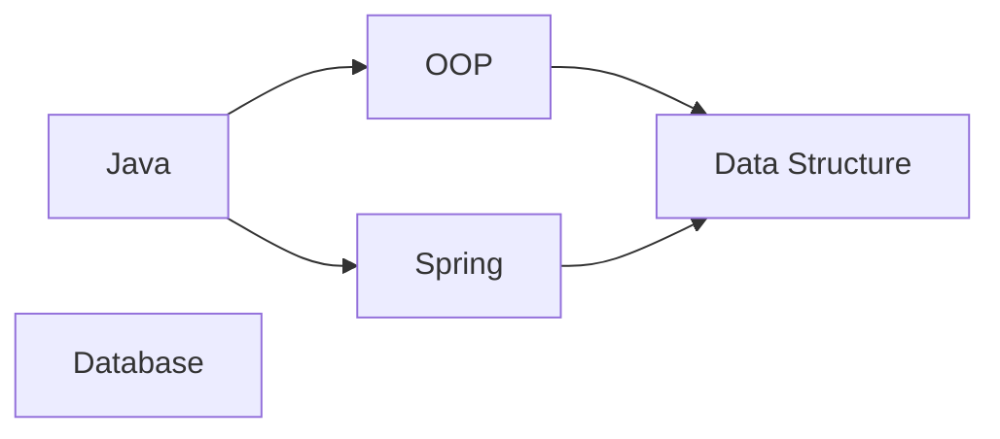
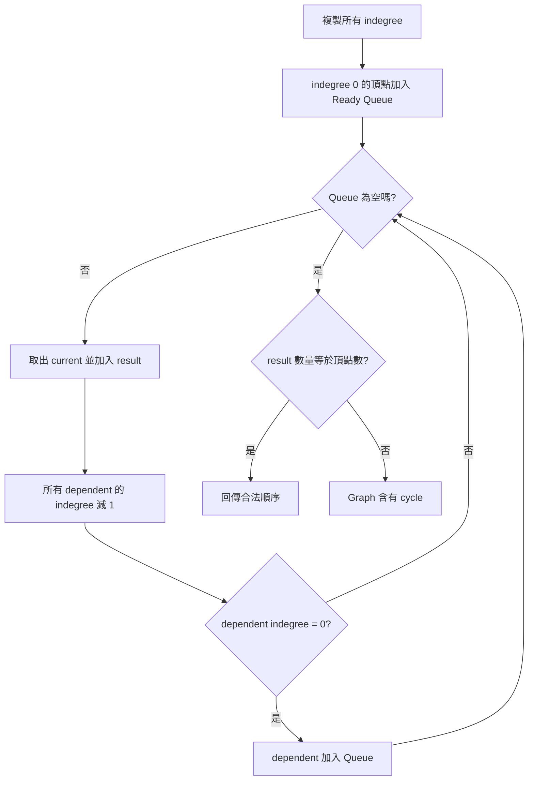
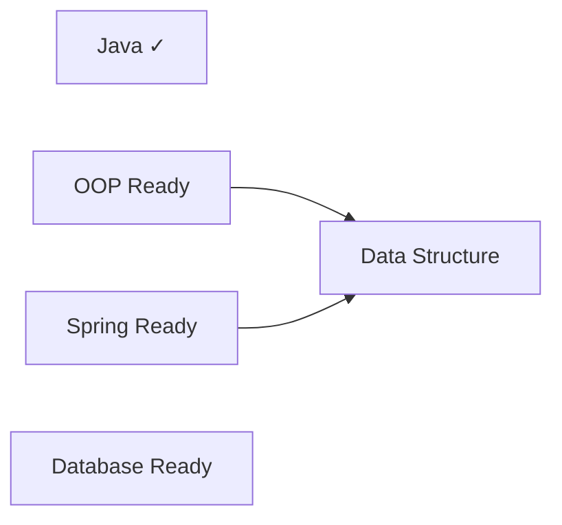
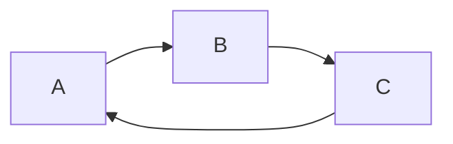

# Topological Sort 完整說明

> 對應程式：`src/main/java/com/centerops/algorithm/TopologicalSort.java`

## 1. Topological Sort 要解決什麼問題？

拓樸排序用來排列具有先後依賴關係的工作。

在課程圖中，若 Java 是 OOP 的先修課，合法結果必須滿足：

```text
Java 出現在 OOP 前面
```

它不是依照名稱、ID 或難度排序，而是依照 Graph 的 directed edges 排列。

拓樸排序只適用於 Directed Acyclic Graph（DAG，有向無環圖）。只要 Graph 含有 cycle，就不存在合法順序。

---

## 2. 邊方向與排序意義

本專案的邊固定為：

```text
prerequisite → dependent course
```



合法拓樸順序可能是：

```text
Java, Database, OOP, Spring, Data Structure
```

也可能是：

```text
Database, Java, Spring, OOP, Data Structure
```

兩者都正確，因為都符合：

- Java 在 OOP 前。
- Java 在 Spring 前。
- OOP 在 Data Structure 前。
- Spring 在 Data Structure 前。

---

## 3. 拓樸排序的三個重要觀念

### Indegree

指向某個頂點的邊數。在課程圖中代表還有多少直接先修依賴。

```text
Java           indegree = 0
Database       indegree = 0
OOP            indegree = 1
Spring         indegree = 1
Data Structure indegree = 2
```

### Ready Queue

indegree 為 0 的頂點沒有尚未處理的先修依賴，可以立即排入結果。

### Kahn's Algorithm

反覆取出 indegree 0 的頂點，視為移除它與它的 outgoing edges。當 dependent 的剩餘 indegree 變成 0，就加入 Ready Queue。

---

## 4. Stateless Utility Class

```java
public final class TopologicalSort {

    private TopologicalSort() {
    }
}
```

不需要建立物件：

```java
List<Long> order = TopologicalSort.sort(graph);
boolean cycle = TopologicalSort.hasCycle(graph);
```

每次呼叫都建立 indegree 副本、Queue 與 result，不改變原始 CourseGraph。

---

## 5. 公開方法

| 方法 | 用途 | 回傳值 | 可能例外 | 複雜度 |
|---|---|---|---|---:|
| `sort(CourseGraph<T>)` | 產生一組合法拓樸順序 | 不可修改的 List | null；Graph 有 cycle | `O(V + E)` |
| `hasCycle(CourseGraph<T>)` | 判斷是否存在 cycle | boolean | graph 為 null | `O(V + E)` |

空 Graph 的拓樸排序是空 List，且不含 cycle。

---

## 6. 為什麼要複製 indegree？

```java
CustomHashTable<T, Integer> remainingIndegrees = new CustomHashTable<>();
```

Kahn’s Algorithm 會持續把 indegree 減 1，但這只是「假想移除邊」的運算過程，不應破壞 CourseGraph 真正保存的 indegree。

```text
CourseGraph indegree：原始資料，保持不變
remainingIndegrees：演算法工作副本，持續遞減
```

初始化：

```java
for (T vertex : graph.vertices()) {
    int indegree = graph.indegreeOf(vertex);
    remainingIndegrees.put(vertex, indegree);
    if (indegree == 0) {
        ready.add(vertex);
    }
}
```

---

## 7. 核心迴圈

```java
while (!ready.isEmpty()) {
    T current = ready.remove();
    result.add(current);

    for (T dependent : graph.neighborsOf(current)) {
        int remaining = remainingIndegrees.get(dependent) - 1;
        remainingIndegrees.put(dependent, remaining);
        if (remaining == 0) {
            ready.add(dependent);
        }
    }
}
```

每次執行：

1. 取出一個已沒有先修依賴的 current。
2. 把 current 放入結果。
3. 視為移除 current 指向 dependent 的每條邊。
4. dependent 的剩餘 indegree 減 1。
5. 若 dependent indegree 變成 0，加入 Ready Queue。



---

## 8. 完整圖形變化

使用以下圖：


頂點加入順序：Java、OOP、Spring、Data Structure、Database。

### Step 0：計算初始 indegree

```text
Java           = 0
OOP            = 1
Spring         = 1
Data Structure = 2
Database       = 0

ready  = [Java, Database]
result = []
```

### Step 1：處理 Java

```text
result = [Java]

OOP indegree:    1 → 0，加入 Queue
Spring indegree: 1 → 0，加入 Queue

ready = [Database, OOP, Spring]
```

圖形概念是先「移除」Java 與它的 outgoing edges：



### Step 2：處理 Database

Database 沒有 outgoing edge：

```text
ready  = [OOP, Spring]
result = [Java, Database]
```

Disconnected vertex 仍會包含在結果中，因為它的 indegree 是 0。

### Step 3：處理 OOP

```text
Data Structure indegree: 2 → 1

ready  = [Spring]
result = [Java, Database, OOP]
```

Data Structure 還依賴 Spring，因此不能加入 Queue。

### Step 4：處理 Spring

```text
Data Structure indegree: 1 → 0

ready  = [Data Structure]
result = [Java, Database, OOP, Spring]
```

### Step 5：處理 Data Structure

```text
ready  = []
result = [Java, Database, OOP, Spring, Data Structure]
```

結果數量 5 等於頂點數 5，排序成功。

---

## 9. 如何偵測 Cycle？

考慮：



初始 indegree：

```text
A = 1
B = 1
C = 1
```

沒有任何 indegree 0 的頂點：

```text
ready  = []
result = []
```

演算法無法開始，但 Graph 有 3 個頂點，因此：

```java
if (result.size() != graph.vertexCount()) {
    throw new IllegalStateException("Course graph contains a cycle");
}
```

更一般地說，cycle 中的節點會一直保有至少一個來自 cycle 的 incoming edge，因此永遠不會進入 Ready Queue。

---

## 10. hasCycle 的設計

```java
public static <T> boolean hasCycle(CourseGraph<T> graph) {
    try {
        sort(graph);
        return false;
    } catch (IllegalStateException exception) {
        return true;
    }
}
```

`sort` 已經完整實作 Kahn’s Algorithm 與 cycle 判定；`hasCycle` 重用相同規則，避免維護兩套可能不一致的 cycle logic。

```text
sort 成功     → 沒有 cycle → false
sort 無法完成 → 存在 cycle → true
```

這個 MVP 版本以可讀性為優先。未來若需要更精細的錯誤分類，可抽出共同的 private analysis result，而不是以例外傳遞判定。

---

## 11. 為什麼排序結果不唯一？

如果同時有多個 indegree 0 的節點，它們彼此沒有必須遵守的順序。

例如 Java 與 Database 都是 indegree 0：

```text
[Java, Database, ...]     合法
[Database, Java, ...]     也合法
```

本實作使用 Queue，初始順序來自 `graph.vertices()` 的頂點加入順序，因此結果具有可預期性，但不能宣稱是唯一答案。

---

## 12. 相鄰結果不代表存在直接邊

結果：

```text
Java, Database, OOP, Spring, Data Structure
```

Java 與 Database 在結果中相鄰，但 Graph 沒有：

```text
Java → Database
```

拓樸排序只保證：

```text
每一條 A → B，都必須讓 A 出現在 B 前面
```

它不保證結果相鄰元素之間有 edge。因此前端應使用 `nodes` 與 `edges` 顯示真正關係，不能把 topologicalOrder 每兩個相鄰節點直接畫線。

---

## 13. 時間與空間複雜度

初始化會走過所有 V 個頂點；核心迴圈會讓每個頂點入列、出列一次，並檢查每條邊一次：

```text
時間複雜度：O(V + E)
```

remainingIndegrees、ready 與 result 最多保存 V 個頂點：

```text
空間複雜度：O(V)
```

---

## 14. MVP 取捨與限制

- 使用 Kahn’s Algorithm，而不是 DFS finishing time，因為 indegree 與 Queue 的變化更容易展示。
- 使用自訂 CustomHashTable 保存 indegree 副本。
- Queue 使用 Java ArrayDeque，沒有重寫專題未要求的 Queue。
- 排序結果不唯一，但在相同頂點與邊加入順序下保持穩定。
- cycle 時只回報 Graph 含有 cycle，不列出完整 cycle 路徑。
- hasCycle 為提高可讀性而重用 sort 的例外；大量高頻呼叫時可以再重構共同分析方法。

---

## 15. 常見答辯問題

### Q1：為什麼只有 indegree 0 的節點可以先處理？

indegree 0 表示沒有任何尚未處理的 prerequisite，因此它可以合法地排在目前結果的下一個位置。

### Q2：為什麼要複製 indegree？

演算法中的減 1 代表假想移除邊，不應改變 Graph 的真實資料；否則排序一次後 Graph 就被破壞。

### Q3：怎麼知道 Graph 有 cycle？

若 Queue 已空但仍有節點沒進入結果，代表這些節點的 indegree 無法降到 0，它們被 cycle 互相依賴。

### Q4：拓樸排序結果是否只有一種？

不是。多個 indegree 0 節點可以用不同順序處理，只要所有 prerequisite 都早於 dependent 即合法。

### Q5：為什麼 disconnected vertex 也會出現在結果？

它沒有依賴，indegree 是 0，從一開始就能加入 Ready Queue。拓樸排序應包含 Graph 中全部頂點。

### Q6：結果中相鄰的課程一定有先修關係嗎？

不一定。拓樸順序只約束 edge 的前後，不會為沒有 edge 的相鄰節點建立關係。

### Q7：為什麼選 Kahn’s Algorithm？

CourseGraph 已保存 indegree；Kahn’s Algorithm 可直接利用它，而且 Queue 與 indegree 變化適合 Demo 與答辯。

### Q8：Cycle Detection 為什麼不寫在 CourseGraph？

CourseGraph 是資料結構，負責保存頂點與邊；TopologicalSort 是演算法。分離後可以建立有 cycle 的 Graph 來測試演算法。

---

## 16. 最短口頭說明版本

> Topological Sort 使用 Kahn’s Algorithm。先把所有 indegree 0 的課程加入 Queue；每取出一門課，就將它指向課程的剩餘 indegree 減 1，降到 0 時再加入 Queue。若最後處理數量少於頂點數，代表存在 cycle。時間複雜度是 O(V+E)。
