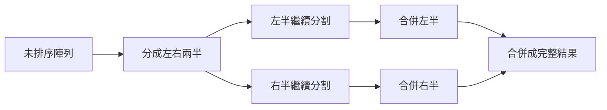
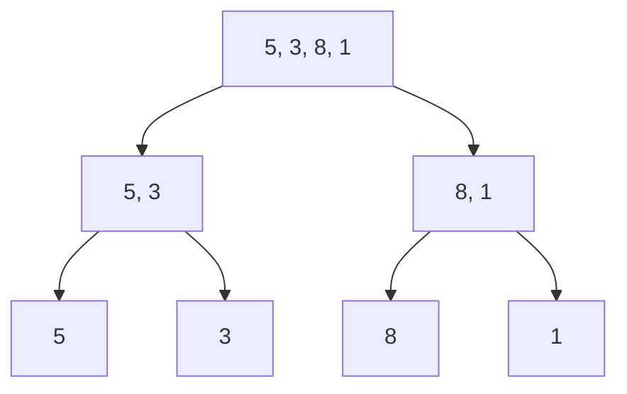
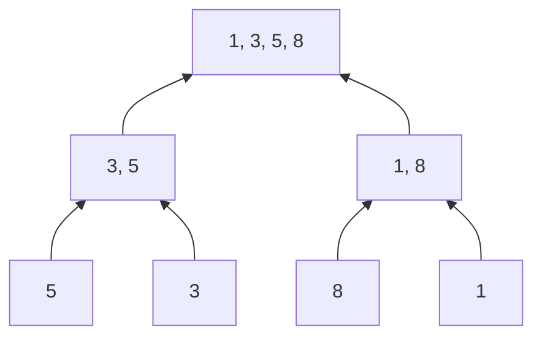

# Merge Sort 完整說明

> 對應程式：`src/main/java/com/centerops/algorithm/MergeSort.java`

## 1. Merge Sort 要解決什麼問題？

Merge Sort，中文稱「合併排序」，使用 Divide and Conquer（分割與征服）將資料由小到大排列。

它的主要概念不是直接在整個陣列中找最小值，而是：

1. 將大問題分成左右兩個小問題。
2. 分到每個區間只剩一個元素。
3. 將兩個已排序的小區間合併。
4. 持續合併，得到完整排序結果。



---

## 2. 本專案的輸入與輸出

本專案保留兩個公開版本。整數版最容易用來解釋演算法：

```java
int[] input = {5, 3, 8, 1};
int[] result = MergeSort.sort(input);
```

結果：

```text
input  = [5, 3, 8, 1]
result = [1, 3, 5, 8]
```

原始 input 不會被修改。這項設計能避免呼叫端在不知情的情況下失去原始資料。

泛型版供 Enrollment API 實際整合：

```java
List<Enrollment> sorted = MergeSort.sort(enrollments, enrollmentComparator);
```

它能依呼叫端提供的 `Comparator` 排列任何物件，也不會修改原始 List。

---

## 3. 為什麼同時保留 int[] 與泛型版本？

專案規格要求展示 Merge Sort，測試範例也是：

```text
5, 3, 8, 1 → 1, 3, 5, 8
```

保留 `int[]` 可以：

- 專注展示分割與合併。
- 先不引入 Comparator，讓組員分階段理解。
- 讓答辯程式碼更短、更直觀。

但 `int[]` 無法依課程名稱排序 Enrollment，因此另外提供 `List<T> + Comparator` overload。兩個版本使用相同的
Divide、Merge 流程；泛型版只把 `<=` 的大小判斷改為 `comparator.compare(left, right) <= 0`。

---

## 4. Stateless Utility Class

```java
public final class MergeSort {

    private MergeSort() {
    }
}
```

- `final`：不需要被繼承。
- private constructor：不允許建立沒有狀態的物件。
- public static `sort`：直接透過類別名稱使用。
- 每次呼叫使用自己的 sorted 與 temporary 陣列。

呼叫方式：

```java
int[] sorted = MergeSort.sort(values);

List<Enrollment> sortedEnrollments = MergeSort.sort(enrollments, comparator);
```

---

## 5. 公開方法

| 方法 | 用途 | 回傳值 | 可能例外 | 複雜度 |
|---|---|---|---|---:|
| `sort(int[] values)` | 將整數由小到大排序 | 新的已排序陣列 | values 為 null 時 `NullPointerException` | `O(n log n)` |
| `sort(List<T>, Comparator)` | 依自訂規則排序物件 | 新的已排序清單 | values 或 comparator 為 null 時 `NullPointerException` | `O(n log n)` |

空陣列回傳空陣列；單一元素陣列回傳內容相同的新陣列。

泛型版的 Comparator 由應用層提供。例如 Enrollment 使用：

```java
Comparator<Enrollment> enrollmentOrder = Comparator
        .comparing(
                enrollment -> enrollment.getCourse().getName(),
                String.CASE_INSENSITIVE_ORDER
        )
        .thenComparing(Enrollment::getId);
```

MergeSort 不需要知道 Enrollment、Course 或 direction，仍保持為獨立演算法。

---

## 6. sort：建立安全副本與暫存空間

```java
public static int[] sort(int[] values) {
    Objects.requireNonNull(values, "values must not be null");
    int[] sorted = Arrays.copyOf(values, values.length);
    int[] temporary = new int[values.length];
    sortRange(sorted, temporary, 0, sorted.length - 1);
    return sorted;
}
```

### `sorted`

原始陣列的副本。真正的排序都發生在 sorted：

```text
values → [5, 3, 8, 1]  保持不變
sorted → [5, 3, 8, 1]  接受排序修改
```

### `temporary`

合併兩個區間時使用的暫存陣列。整次排序只建立一個，所有遞迴共用，避免每次 merge 都建立新陣列。

### 初始範圍

```java
sortRange(sorted, temporary, 0, sorted.length - 1);
```

對長度 4 的陣列：

```text
left = 0
right = 3
處理範圍 = index 0～3
```

空陣列時 right 是 -1，base case 會立即結束。

---

## 7. Divide：如何持續分割？

```java
private static void sortRange(
        int[] values,
        int[] temporary,
        int left,
        int right
) {
    if (left >= right) {
        return;
    }

    int middle = left + (right - left) / 2;
    sortRange(values, temporary, left, middle);
    sortRange(values, temporary, middle + 1, right);
    merge(values, temporary, left, middle, right);
}
```

分割公式：

```text
左半：left ～ middle
右半：middle + 1 ～ right
```

使用：

```java
left + (right - left) / 2
```

而不是：

```java
(left + right) / 2
```

前者可以避免 left + right 在極大陣列中發生整數 overflow。

---

## 8. Base Case：什麼時候停止分割？

```java
if (left >= right) {
    return;
}
```

### 一個元素

```text
left = right
[5]
```

單一元素本身已排序，不必再分。

### 空區間

```text
left > right
```

例如空陣列初始呼叫是 left 0、right -1，也會立即結束。

若沒有 base case，遞迴就不會停止。

---

## 9. `[5, 3, 8, 1]` 的完整分割圖



以 index 表示：

```text
sortRange(0, 3), middle = 1
├── sortRange(0, 1), middle = 0
│   ├── sortRange(0, 0) → return
│   └── sortRange(1, 1) → return
└── sortRange(2, 3), middle = 2
    ├── sortRange(2, 2) → return
    └── sortRange(3, 3) → return
```

分割本身不負責交換元素；真正排序發生在回溯時的 merge。

---

## 10. Conquer：如何合併兩個已排序區間？

假設左右兩邊已排序：

```text
左半：[3, 5]
右半：[1, 8]
```

使用兩個指標：

```text
leftIndex  → 左半目前最小且尚未寫回的值
rightIndex → 右半目前最小且尚未寫回的值
writeIndex → 下一個要寫回 values 的位置
```

每次比較左右目前值，把較小者寫回。

---

## 11. merge 的第一步：複製目前區間

```java
System.arraycopy(values, left, temporary, left, right - left + 1);
```

為什麼需要 temporary？若直接一邊讀 values、一邊覆寫 values，尚未比較的原始資料可能被蓋掉。

```text
合併前 values：    [3, 5, 1, 8]
複製 temporary：  [3, 5, 1, 8]

讀取來源：temporary
寫入目標：values
```

---

## 12. merge 的核心比較

```java
while (leftIndex <= middle && rightIndex <= right) {
    if (temporary[leftIndex] <= temporary[rightIndex]) {
        values[writeIndex++] = temporary[leftIndex++];
    } else {
        values[writeIndex++] = temporary[rightIndex++];
    }
}
```

### 合併 `[3, 5]` 與 `[1, 8]`

#### 比較 3 與 1

```text
1 較小
values = [1, _, _, _]
右指標移到 8
```

#### 比較 3 與 8

```text
3 較小
values = [1, 3, _, _]
左指標移到 5
```

#### 比較 5 與 8

```text
5 較小
values = [1, 3, 5, _]
左半用完
```

#### 複製右半剩餘的 8

```text
values = [1, 3, 5, 8]
```

---

## 13. 為什麼還需要兩個剩餘迴圈？

```java
while (leftIndex <= middle) {
    values[writeIndex++] = temporary[leftIndex++];
}

while (rightIndex <= right) {
    values[writeIndex++] = temporary[rightIndex++];
}
```

核心比較只在左右兩邊都還有資料時執行。當其中一邊用完，另一邊剩餘資料本身已排序，可以直接依序複製。

```text
左半剩餘：[5, 9]
右半：已用完

直接把 5、9 接到結果後方
```

---

## 14. 完整合併圖



完整流程：

```text
分割：
[5, 3, 8, 1]
   ↓
[5, 3] [8, 1]
   ↓       ↓
[5] [3] [8] [1]

合併：
[5] + [3] → [3, 5]
[8] + [1] → [1, 8]
[3, 5] + [1, 8] → [1, 3, 5, 8]
```

---

## 15. 為什麼比較時使用 `<=`？

```java
if (temporary[leftIndex] <= temporary[rightIndex]) {
```

當兩個值相等時，優先取左半元素。對整數結果看不出差異，但這是 Merge Sort 保持 Stable Sort 的關鍵。

Stable Sort 的意思是：排序值相同的元素，排序後仍保持原本相對順序。

```text
排序前：3A, 1, 3B
排序後：1, 3A, 3B
```

目前 int 沒有 A、B 身分，但保留正確比較方式，未來擴充物件版本時仍能維持穩定性。

---

## 16. 時間複雜度

每一層合併總共處理 n 個元素：

```text
第 1 層：處理 n 個
第 2 層：處理 n 個
第 3 層：處理 n 個
...
```

每次把問題分成一半，總層數約為 `log₂ n`：

```text
時間複雜度 = 每層 O(n) × O(log n) 層
            = O(n log n)
```

Merge Sort 的最佳、平均與最壞時間都是：

```text
O(n log n)
```

即使原陣列已經排序，本版仍會完成分割與合併。

---

## 17. 空間複雜度

主要額外空間：

- sorted 副本：O(n)
- temporary 陣列：O(n)
- recursion stack：O(log n)

合併後仍為：

```text
空間複雜度：O(n)
```

本實作不是 in-place sort，這是 Merge Sort 以額外記憶體換取穩定 O(n log n) 效率的典型取捨。

---

## 18. 測試案例

### 一般未排序資料

```text
[5, 3, 8, 1] → [1, 3, 5, 8]
```

### 空陣列

```text
[] → []
```

### 單筆資料

```text
[7] → [7]
```

### 已排序資料

```text
[1, 2, 3, 4] → [1, 2, 3, 4]
```

### 重複值與負數

```text
[3, -1, 3, 0, -5] → [-5, -1, 0, 3, 3]
```

### 不修改輸入

```text
input 在 sort 前後都保持 [5, 3, 8, 1]
```

### null

```text
sort(null) → NullPointerException
```

### 泛型物件與 Stable Sort

```text
[Java#1, Algorithm#2, Java#3]
→ [Algorithm#2, Java#1, Java#3]
```

兩筆 Java 的原始相對順序維持 `#1`、`#3`。

---

## 19. MVP 取捨與限制

- `int[]` 版本固定由小到大；泛型版本的方向由 Comparator 決定。
- 為保護呼叫端資料，會建立輸入副本。
- 共用單一 temporary 陣列，避免每次 merge 重複配置。
- 使用遞迴實作，讓 Divide and Conquer 結構清楚。
- 不是 in-place sort，需要 O(n) 額外空間。
- Enrollment 未指定 courseName 排序時仍交給資料庫分頁。
- 指定 `sort=courseName` 時會將完整條件結果載入記憶體、Merge Sort 後再分頁；這適合目前約 1000 筆的
  MVP 與課程展示，不適合直接套用到大型正式資料集。

---

## 20. 常見答辯問題

### Q1：Merge Sort 的核心概念是什麼？

先把陣列持續分成兩半，直到每段只剩一個元素，再將兩個已排序區間合併。

### Q2：為什麼一個元素可以直接視為已排序？

單一元素不存在前後順序衝突，因此不需要任何比較或交換。

### Q3：為什麼需要 temporary 陣列？

合併時要同時讀取原本左右區間並寫回結果。暫存副本可避免尚未比較的資料被覆蓋。

### Q4：為什麼時間複雜度是 O(n log n)？

陣列每次分半，所以有 log n 層；每一層合併總共處理 n 個元素，因此是 n × log n。

### Q5：Merge Sort 是 Stable Sort 嗎？

是。本實作在相等時使用 `<=`，優先取左半元素，因此可維持相同值的原始相對順序。

### Q6：為什麼不修改原始陣列？

避免方法產生不明顯的 side effect。呼叫端可以同時保留原始資料與排序結果，測試也更容易。

### Q7：為什麼需要泛型版本？

`int[]` 最容易展示 Merge Sort，但無法排序 Enrollment。泛型版本把欄位順序交給 Comparator，因此同一套
演算法可以依課程名稱排序，也能保留容易理解的整數版供答辯。

### Q8：Merge Sort 與 Bubble Sort 相比有什麼優點？

Merge Sort 最壞仍是 O(n log n)；Bubble Sort 一般最壞是 O(n²)，資料量增加時差距會很明顯。

### Q9：Merge Sort 的缺點是什麼？

需要 O(n) 額外空間，且此版本即使資料已排序也仍會執行完整分割與合併。

### Q10：API 如何使用這個 Merge Sort？

只有指定 `sort=courseName` 時使用：Repository 先取得完整條件結果，Merge Sort 排序後，Service 才切出
指定頁面。未指定 sort 時仍使用資料庫分頁，避免所有查詢都載入完整資料。

---

## 21. 最短口頭說明版本

> Merge Sort 使用 Divide and Conquer，先把資料不斷分成左右兩半，直到每段只剩一個元素，再將已排序的
> 左右區間合併。共有 log n 層，每層處理 n 個元素，所以時間複雜度是 O(n log n)，額外空間是 O(n)。
> 本專案保留容易展示的 int[] 版本，並用泛型 Comparator 版本實際完成 Enrollment 課程名稱排序；排序完整
> 結果後才切頁，確保跨頁順序正確。
