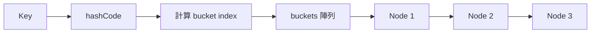
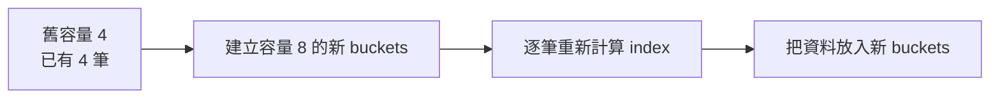

# CustomHashTable 完整說明

> 對應程式：`src/main/java/com/centerops/datastructure/CustomHashTable.java`

## 1. 這個結構要解決什麼問題？

`CustomHashTable<K, V>` 用一個 key 快速找到對應的 value，例如：

```text
personId → Person
courseId → Course
courseId → 該課程的鄰接節點
```

若只使用一般陣列，每次查詢都可能必須從頭找到尾，時間複雜度是 `O(n)`。Hash Table 先把 key 轉成陣列位置，平均可以在 `O(1)` 找到資料。

本實作刻意不使用 `HashMap`，核心儲存由以下兩部分組成：

- `buckets`：存放每一條碰撞鏈開頭的陣列。
- `Node`：保存 key、value，以及同一個 bucket 中的下一個節點。

---

## 2. 整體結構圖



陣列與鏈結節點的實際概念：

```text
buckets
 index
  [0] ──→ null
  [1] ──→ [key=A, value=10] ──→ [key=E, value=50] ──→ null
  [2] ──→ [key=B, value=20] ──→ null
  [3] ──→ null
```

`A` 與 `E` 被算到相同 index，這就是 hash collision。本實作使用 Separate Chaining，把它們串在同一條 linked list 中。

---

## 3. 類別欄位

```java
private static final int DEFAULT_CAPACITY = 16;
private static final double MAX_LOAD_FACTOR = 0.75;
private static final int RESIZE_MULTIPLIER = 2;

private Node<K, V>[] buckets;
private int size;
```

### `DEFAULT_CAPACITY`

沒有指定容量時，建立 16 個 buckets。

### `MAX_LOAD_FACTOR`

負載因子的上限是 0.75。負載因子不是 overflow，而是資料筆數與 bucket 容量的比例：

```text
load factor = size / buckets.length
```

例如容量 16、資料 12 筆時，load factor 是 `12 / 16 = 0.75`。再新增一筆後超過上限，系統就會擴容。

### `RESIZE_MULTIPLIER`

擴容時將 bucket 容量乘以 2。將數字拉成具名常數後，閱讀程式時不需要猜測 `2` 的用途。

### `buckets`

真正保存資料的陣列。每個位置保存一條 Node 鏈的開頭，而不是直接保存 value。

### `size`

目前實際保存的 key-value 數量。更新既有 key 不會增加 size。

---

## 4. Node 的角色

```java
private static final class Node<K, V> {
    private final K key;
    private V value;
    private Node<K, V> next;
}
```

每一個 Node 保存：

- `key`：查詢依據，建立後不修改。
- `value`：key 對應的值，可以被更新。
- `next`：同一個 bucket 中的下一個 Node。

圖形表示：

```text
┌─────────┬───────────┬──────────┐
│ key = A │ value = 10│ next ────────→ 下一個 Node
└─────────┴───────────┴──────────┘
```

---

## 5. Hash index 如何計算？

```java
private int bucketIndex(K key) {
    int hashValue = key.hashCode();
    return Math.floorMod(hashValue, buckets.length);
}
```

這裡刻意使用 `bucketIndex`，而不是較模糊的 `indexOf`：方法名稱直接表示它回傳的是 buckets 陣列的位置。

計算流程：

```text
key
 ↓ hashCode()
整數 hash value
 ↓ floorMod(hash, capacity)
合法陣列位置 0 ～ capacity-1
```

使用 `Math.floorMod` 的原因，是 Java 的 hashCode 可能為負數；`floorMod` 可以保證結果不會成為負的陣列 index。

範例：

```text
hashCode = 37，capacity = 16
37 mod 16 = 5
資料放到 buckets[5]
```

---

## 6. 公開方法

| 方法 | 用途 | 回傳值 | 可能例外 | 平均複雜度 |
|---|---|---|---|---:|
| `CustomHashTable()` | 建立容量 16 的表格 | 新物件 | 無 | `O(1)` |
| `CustomHashTable(int capacity)` | 建立指定容量的表格 | 新物件 | capacity ≤ 0 時 `IllegalArgumentException` | `O(capacity)` |
| `put(K key, V value)` | 新增或更新資料 | 更新時回傳舊值；新增時回傳 `null` | key 為 null 時 `NullPointerException` | 平均 `O(1)` |
| `get(K key)` | 取得 key 對應的 value | 找不到時 `null` | key 為 null 時 `NullPointerException` | 平均 `O(1)` |
| `containsKey(K key)` | 判斷 key 是否存在 | `true`／`false` | key 為 null 時 `NullPointerException` | 平均 `O(1)` |
| `remove(K key)` | 刪除 key 與 value | 被刪除的 value；找不到時 `null` | key 為 null 時 `NullPointerException` | 平均 `O(1)` |
| `size()` | 取得資料筆數 | 整數 | 無 | `O(1)` |

最壞情況下，所有 key 都落在同一個 bucket，查詢、更新和刪除都會退化成 `O(n)`。

---

## 7. put：新增與更新

重點程式：

```java
int index = bucketIndex(key);

for (Node<K, V> node = buckets[index]; node != null; node = node.next) {
    if (node.key.equals(key)) {
        V oldValue = node.value;
        node.value = value;
        return oldValue;
    }
}

buckets[index] = new Node<>(key, value, buckets[index]);
size++;
```

它分成兩種情況。

### 情況 A：key 已存在

```text
put("A", 10)

[A, 5] → null
   ↓ 更新 value
[A, 10] → null
```

不建立新 Node，`size` 也不增加，並回傳舊值 `5`。

### 情況 B：key 不存在

新 Node 插在鏈結串列最前面：

```text
原本 buckets[1]
[A, 10] → null

執行 put("E", 50)，而 E 也落在 index 1

新的 buckets[1]
[E, 50] → [A, 10] → null
```

插入鏈首不需要走到 linked list 尾端，因此建立 Node 本身是 `O(1)`。

---

## 8. get 與 containsKey

兩者都共用 `findNode`：

```java
private Node<K, V> findNode(K key) {
    int index = bucketIndex(key);
    for (Node<K, V> node = buckets[index]; node != null; node = node.next) {
        if (node.key.equals(key)) {
            return node;
        }
    }
    return null;
}
```

查詢只走 key 所屬的碰撞鏈，不需要掃描整個 buckets 陣列。

```text
找 key A
 ↓
算出 index 1
 ↓
[E, 50] → [A, 10] → null
             ↑ 找到
```

`get` 回傳 Node 的 value；`containsKey` 只判斷 Node 是否存在。

這個區分很重要：即使某個 key 的 value 是 `null`，`containsKey` 仍能正確判斷 key 存在。

---

## 9. remove：刪除鏈結節點

刪除時同時保存 `previous` 與 `current`：

```java
Node<K, V> previous = null;
Node<K, V> current = buckets[index];
```

### 刪除鏈首

```text
刪除 E 前：buckets[1] → [E] → [A] → null
刪除 E 後：buckets[1] ─────→ [A] → null
```

對應程式：

```java
buckets[index] = current.next;
```

### 刪除鏈中節點

```text
刪除 A 前：[E] → [A] → [I] → null
刪除 A 後：[E] ─────→ [I] → null
```

對應程式：

```java
previous.next = current.next;
```

刪除成功後 `size--`，並回傳被刪除的 value。

---

## 10. Load Factor 與 resize

是否擴容由一個具名方法判斷：

```java
private boolean loadFactorExceeded() {
    return (double) size / buckets.length > MAX_LOAD_FACTOR;
}
```

`(double)` 很重要，確保執行小數除法。例如 `13 / 16` 應得到 `0.8125`，而不是整數除法的 `0`。

put 新增資料後進行判斷：

```java
if (loadFactorExceeded()) {
    resizeBuckets();
}
```

容量會依 `RESIZE_MULTIPLIER` 加倍，並重新放置所有 Node：

```java
buckets = (Node<K, V>[]) new Node[
        oldBuckets.length * RESIZE_MULTIPLIER
];
```



為什麼不能直接複製原本 index？因為 index 與 capacity 有關：

```text
hash 13 mod 4 = 1
hash 13 mod 8 = 5
```

因此擴容後必須 rehash。

圖形變化：

```text
擴容前 capacity = 4
[0] → D
[1] → A → E
[2] → B
[3] → null

擴容後 capacity = 8
[0] → null
[1] → A
[2] → B
[3] → null
[4] → D
[5] → E
[6] → null
[7] → null
```

---

## 11. 必須維持的規則

1. 同一個 key 最多只能有一個 Node。
2. `size` 必須等於所有碰撞鏈的 Node 總數。
3. 每個 Node 必須位於 `bucketIndex(key)` 對應的 bucket。
4. resize 後所有資料必須重新計算 bucket index，並且仍能用原 key 找到。
5. null key 不被允許，避免 index 與 equals 語意不清。

---

## 12. MVP 取捨與限制

- 這不是執行緒安全的結構，多執行緒同時修改時需要額外同步。
- 沒有實作 iterator、keySet 或 values，因為專題只需要核心 CRUD。
- value 可以是 null，但 key 不可以是 null。
- 最壞情況仍可能退化為 linked list 的 `O(n)`。
- 擴容會一次處理全部資料，當次操作成本是 `O(n)`；平均分攤後 put 仍視為 `O(1)`。

---

## 13. 常見答辯問題

### Q1：為什麼不用 HashMap？

因為這個模組的目的就是展示 Hash Table 的 bucket、hash index、collision 與 resize 原理；使用 HashMap 會把核心實作藏起來。

### Q2：兩個 key 得到相同 index 怎麼辦？

使用 Separate Chaining。每個 bucket 保存一條 Node linked list，相同 index 的資料會串在同一條鏈上。

### Q3：為什麼 load factor 使用 0.75？

資料太密集時 collision 會增加；容量太大又浪費空間。0.75 是查詢效率與記憶體使用間常見的平衡值。

### Q4：0.75 為什麼要拉成常數？

直接寫 `0.75` 是 Magic Number，讀者不知道它代表什麼。命名為 `MAX_LOAD_FACTOR` 後，程式會直接表達「超過最大負載因子就擴容」。日後若要改成 0.7 或 0.8，也只需修改一個位置。

### Q5：為什麼 resize 後要重新 hash？

因為 index 是 `hashCode mod capacity`，capacity 改變後，同一個 key 的 index 也可能改變。

### Q6：平均 O(1) 是否代表永遠 O(1)？

不是。Hash 分布良好時平均接近 O(1)；如果大量 collision 集中到同一個 bucket，最壞會是 O(n)。

### Q7：為什麼 remove 需要 previous？

因為刪除 linked list 中間的 Node 時，需要讓前一個 Node 直接指向下一個 Node。

### Q8：為什麼使用 key.hashCode，而不是只支援 String 的手寫公式？

因為 `CustomHashTable<K, V>` 是泛型，key 可能是 String、Long 或其他型別。每個 key 型別透過自己的 `hashCode()` 產生 hash value；HashTable 再負責把它轉成合法的 bucket index。若直接逐字元計算，HashTable 就只能接受 String。

---

## 14. 最短口頭說明版本

> CustomHashTable 先用 key 的 hashCode 計算 bucket index。若不同 key 落在相同 bucket，就用 linked list 解決碰撞。put、get 和 remove 平均是 O(1)。資料超過容量 75% 時，陣列容量加倍並重新 hash，以降低碰撞機率。
