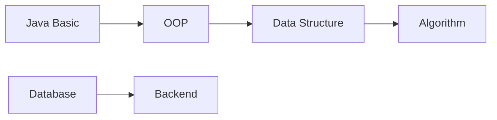
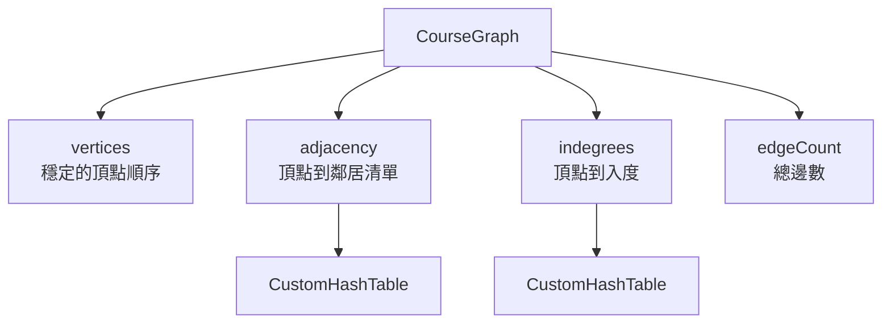
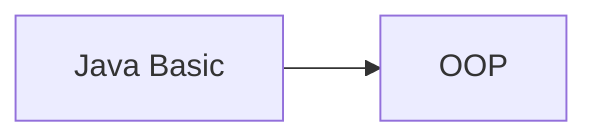
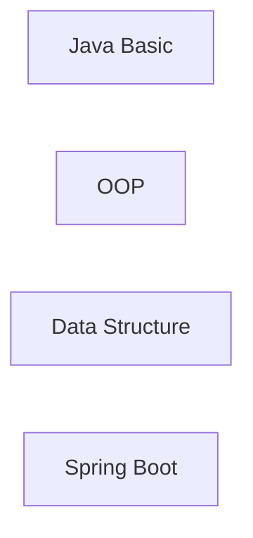
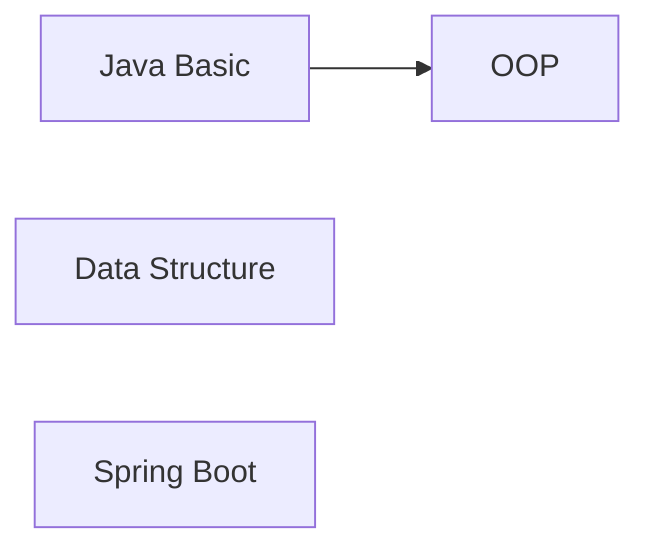
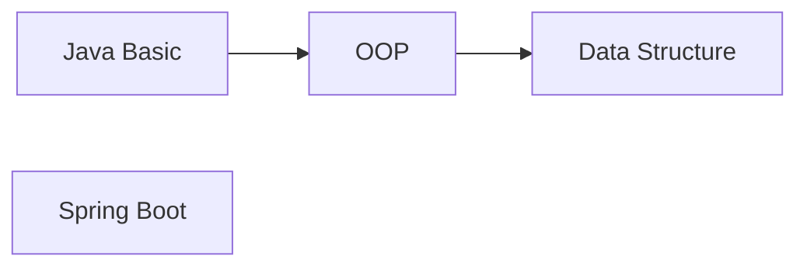
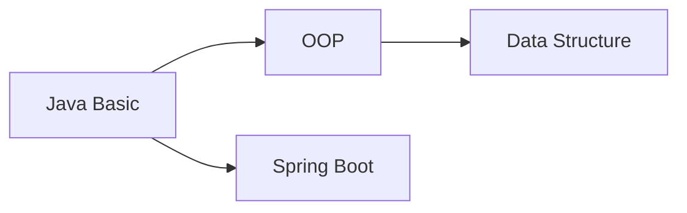
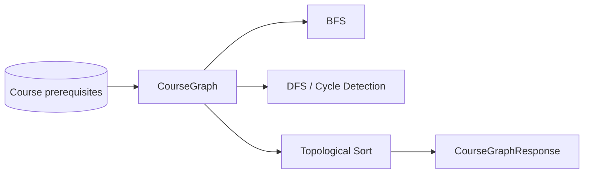

# CourseGraph 完整說明

> 對應程式：`src/main/java/com/centerops/datastructure/CourseGraph.java`

## 1. 這個結構要解決什麼問題？

`CourseGraph<T>` 用有向圖表示課程的先修關係。

本專案固定將邊定義為：

```text
先修課程 → 依賴這門先修課的課程
```

例如 OOP 必須先修 Java Basic：

```text
Java Basic → OOP
```

這個方向不能反過來，因為 BFS、DFS、Cycle Detection 與 Topological Sort 都依賴一致的邊方向。

---

## 2. 圖的基本名詞

- Vertex／Node：圖中的節點，本專案代表課程。
- Edge：節點之間的有方向連線，本專案代表先修關係。
- Neighbor：某節點可以直接到達的下一個節點。
- Indegree：指向某節點的邊數，也就是它有多少直接先修課。
- Adjacency List：每個節點分別保存它指向哪些鄰居。

範例：



對應 adjacency list：

```text
Java Basic     → [OOP]
OOP            → [Data Structure]
Data Structure → [Algorithm]
Database       → [Backend]
Algorithm      → []
Backend        → []
```

---

## 3. 為什麼使用 Adjacency List？

如果使用 adjacency matrix，20 門課要建立 `20 × 20 = 400` 個位置，即使大部分課程之間沒有關係也要占空間。

Adjacency List 只保存真的存在的邊，適合本專案這種 sparse graph。

```text
Adjacency Matrix 空間：O(V²)
Adjacency List 空間： O(V + E)
```

其中 V 是頂點數，E 是邊數。

---

## 4. 類別內部的三份資料

```java
private final List<T> vertices = new ArrayList<>();
private final CustomHashTable<T, List<T>> adjacency = new CustomHashTable<>();
private final CustomHashTable<T, Integer> indegrees = new CustomHashTable<>();
private int edgeCount;
```

### `vertices`

保存節點加入順序，讓輸出與演算法結果具有穩定、容易測試的順序。

```text
[Java Basic, OOP, Data Structure, Algorithm]
```

### `adjacency`

使用自訂 Hash Table 保存每個頂點的鄰居清單。

```text
key = Java Basic
value = [OOP]
```

### `indegrees`

保存每個頂點目前的入度，未來 Topological Sort 不必重新掃描全部邊。

```text
Java Basic     → 0
OOP            → 1
Data Structure → 1
Algorithm      → 1
```

### `edgeCount`

保存實際邊數。重複加入相同邊時不增加。

---

## 5. 結構關係圖



這是一個刻意簡化、適合答辯的版本：Graph 的關係、入度與規則由自己管理；`ArrayList` 只負責保存一串節點，不使用 Java `HashMap` 取代自訂 Hash Table。

---

## 6. 公開方法

| 方法 | 用途 | 回傳值 | 可能例外 | 複雜度 |
|---|---|---|---|---:|
| `addVertex(T vertex)` | 新增頂點 | 新增成功 `true`；重複 `false` | vertex 為 null 時 `NullPointerException` | 平均 `O(1)` |
| `addEdge(T prerequisite, T dependent)` | 新增有向邊 | 新增成功 `true`；重複 `false` | 任一節點不存在時 `IllegalArgumentException` | `O(outdegree)` |
| `containsVertex(T vertex)` | 判斷節點是否存在 | `true`／`false` | null 時由 HashTable 拒絕 | 平均 `O(1)` |
| `containsEdge(T prerequisite, T dependent)` | 判斷邊是否存在 | `true`／`false` | 無 | `O(outdegree)` |
| `vertices()` | 取得所有頂點 | 不可修改的 List | 無 | `O(V)` |
| `neighborsOf(T vertex)` | 取得直接鄰居 | 不可修改的 List | 頂點不存在時 `IllegalArgumentException` | `O(outdegree)` |
| `indegreeOf(T vertex)` | 取得入度 | 整數 | 頂點不存在時 `IllegalArgumentException` | 平均 `O(1)` |
| `vertexCount()` | 取得頂點數 | 整數 | 無 | `O(1)` |
| `edgeCount()` | 取得邊數 | 整數 | 無 | `O(1)` |

`outdegree` 表示該節點指向多少個直接鄰居。

---

## 7. addVertex：加入一門課

重點程式：

```java
if (adjacency.containsKey(vertex)) {
    return false;
}
vertices.add(vertex);
adjacency.put(vertex, new ArrayList<>());
indegrees.put(vertex, 0);
return true;
```

新增頂點時要同步更新三份資料：

```text
執行 addVertex("Java Basic")

vertices:
[] → [Java Basic]

adjacency:
空 → Java Basic → []

indegrees:
空 → Java Basic → 0
```

新課程還沒有指向其他課，也沒有先修課，所以鄰居清單為空、indegree 為 0。

如果頂點已存在，直接回傳 false，避免相同課程出現兩次。

---

## 8. addEdge：加入先修關係

重點程式：

```java
List<T> neighbors = requireNeighbors(prerequisite);
requireNeighbors(dependent);
if (neighbors.contains(dependent)) {
    return false;
}
neighbors.add(dependent);
indegrees.put(dependent, indegrees.get(dependent) + 1);
edgeCount++;
```

加入 `Java Basic → OOP` 時發生三件事：

1. 把 OOP 放進 Java Basic 的鄰居清單。
2. OOP 的 indegree 加 1。
3. edgeCount 加 1。

### 加邊前

```text
adjacency
Java Basic → []
OOP        → []

indegree
Java Basic → 0
OOP        → 0

edgeCount = 0
```

### 執行

```java
graph.addEdge("Java Basic", "OOP");
```

### 加邊後



```text
adjacency
Java Basic → [OOP]
OOP        → []

indegree
Java Basic → 0
OOP        → 1

edgeCount = 1
```

若再次加入完全相同的邊，方法回傳 false，其他資料都不改變。

---

## 9. 多條邊加入時的圖形變化

### Step 1：只有節點



```text
所有 indegree 都是 0
```

### Step 2：加入 Java Basic → OOP



```text
OOP indegree = 1
```

### Step 3：加入 OOP → Data Structure



```text
Data Structure indegree = 1
```

### Step 4：加入 Java Basic → Spring Boot



```text
adjacency
Java Basic     → [OOP, Spring Boot]
OOP            → [Data Structure]
Data Structure → []
Spring Boot    → []

indegree
Java Basic     → 0
OOP            → 1
Data Structure → 1
Spring Boot    → 1
```

---

## 10. 為什麼 vertices() 與 neighborsOf() 要回傳 copy？

```java
return List.copyOf(vertices);
```

如果直接回傳內部 List，外部程式就可能這樣破壞 Graph：

```java
graph.vertices().clear();
```

這會造成 vertices、adjacency、indegrees 三份資料不一致。

回傳不可修改的 copy，外部可以讀取但不能直接改變 Graph；所有修改必須經過 `addVertex` 或 `addEdge`。

---

## 11. requireNeighbors 的用途

```java
private List<T> requireNeighbors(T vertex) {
    List<T> neighbors = adjacency.get(vertex);
    if (neighbors == null) {
        throw new IllegalArgumentException("Unknown graph vertex: " + vertex);
    }
    return neighbors;
}
```

它同時完成兩件事：

1. 找出指定頂點的 adjacency list。
2. 保證頂點真的存在。

因此 `addEdge(A, B)` 不會偷偷建立未知節點。呼叫端必須先清楚地 `addVertex(A)`、`addVertex(B)`，資料流程比較容易追蹤。

---

## 12. Graph 與 Algorithm 的責任分離

CourseGraph 只負責保存：

- 有哪些頂點。
- 有哪些邊。
- 每個頂點的鄰居。
- 每個頂點的 indegree。

它不負責：

- BFS。
- DFS。
- Cycle Detection。
- Topological Sort。

這些會放在獨立的 algorithm class：



這樣每個演算法都是 stateless，能獨立測試，也符合 Separation of Responsibility。

---

## 13. 必須維持的規則

1. 每個 vertex 在 vertices、adjacency、indegrees 中都必須存在且只出現一次。
2. 邊方向永遠是 prerequisite → dependent。
3. 重複邊不能增加 edgeCount 或 indegree。
4. 新頂點的 adjacency list 必須為空。
5. 新頂點的 indegree 必須是 0。
6. 每新增一條指向 dependent 的邊，dependent indegree 必須加 1。

---

## 14. MVP 取捨與限制

- 目前沒有 `removeVertex` 或 `removeEdge`，因為 MVP 的 Graph 是由資料庫關係重新建立。
- `addEdge` 只保存邊，不阻止 cycle；cycle 由獨立演算法檢查。
- 使用 `ArrayList` 保存頂點順序與鄰居，但索引結構使用自訂 `CustomHashTable`。
- `containsEdge` 與重複邊檢查需要掃描該節點的鄰居，因此是 `O(outdegree)`。
- 不支援平行邊；相同 prerequisite 與 dependent 只能有一條關係。
- 本類別不是執行緒安全的。

---

## 15. 常見答辯問題

### Q1：為什麼邊是先修課指向後續課程？

因為拓樸排序會讓來源節點先出現。使用 prerequisite → dependent，排序結果自然會讓先修課排在依賴課程之前。

### Q2：為什麼不用 adjacency matrix？

課程圖的邊相對少，是 sparse graph。Adjacency List 只保存存在的邊，空間是 O(V+E)，比 O(V²) 適合。

### Q3：為什麼要額外保存 indegree？

Topological Sort 需要知道哪些節點沒有未完成的先修依賴。預先保存 indegree，可以直接建立初始 queue。

### Q4：addEdge 為什麼不直接自動建立節點？

明確要求先 addVertex 可以更早發現資料錯誤，避免拼錯 ID 或缺少課程時悄悄產生不完整節點。

### Q5：為什麼 Graph 內還使用 ArrayList？

專題需要自訂重要資料結構，不代表所有容器都要重寫。Graph 的邊、入度、去重與索引規則由我們實作；ArrayList 只負責保存有順序的一串值，使程式更容易閱讀與答辯。

### Q6：CourseGraph 本身會阻止 cycle 嗎？

不會。Graph 是儲存結構；Cycle Detection 是演算法。分開後可以故意建立有 cycle 的 Graph 來測試演算法。

### Q7：拓樸排序結果中相鄰課程一定有直接關係嗎？

不一定。拓樸排序只保證每門先修課出現在依賴它的課之前，不保證輸出中相鄰的兩門課有直接 edge。

---

## 16. 最短口頭說明版本

> CourseGraph 使用 adjacency list 保存課程先修關係，邊固定由先修課指向依賴課程。自訂 Hash Table 讓我們能快速找到某課程的鄰居與 indegree。Graph 只負責保存資料，BFS、DFS、Cycle Detection 和 Topological Sort 由獨立演算法負責。
