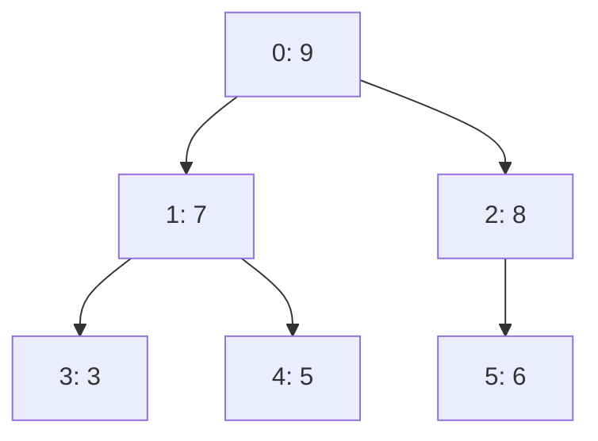
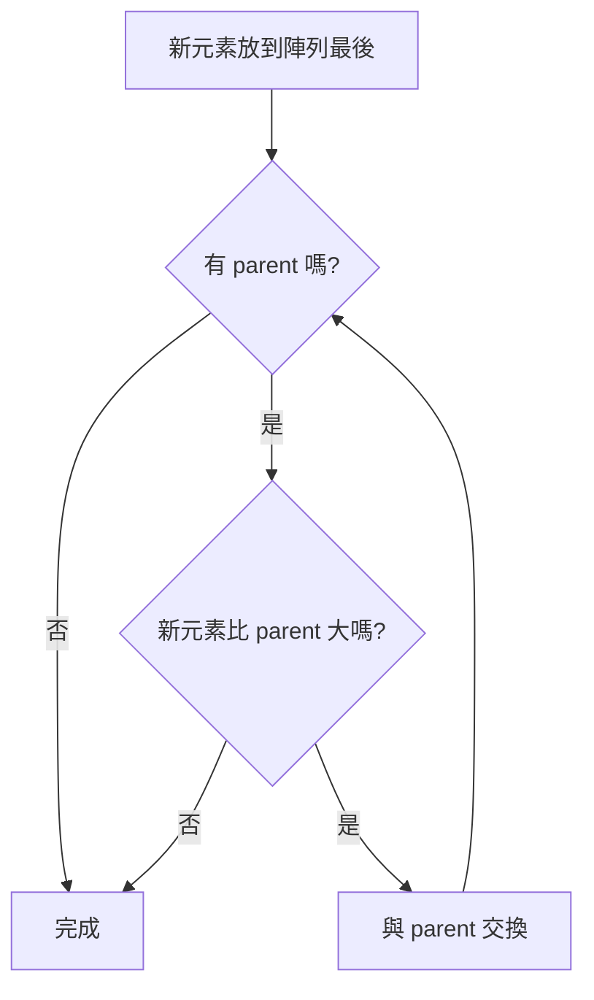
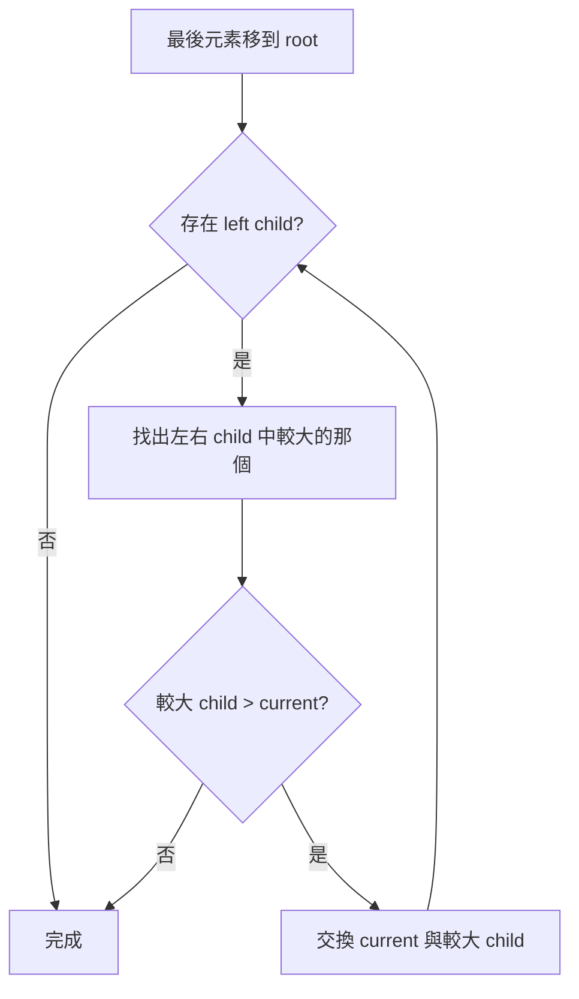

# MaxHeap 完整說明

> 對應程式：`src/main/java/com/centerops/datastructure/MaxHeap.java`

## 1. 這個結構要解決什麼問題？

`MaxHeap<T>` 用來快速取得「優先度最大」的資料。

在本專案中可用於警示排序：

```text
priority 3：高優先級
priority 2：中優先級
priority 1：低優先級
```

如果每次都重新排序全部 Alert，成本通常是 `O(n log n)`。Max Heap 插入一筆是 `O(log n)`，查看最高優先項目是 `O(1)`，移除最高優先項目是 `O(log n)`。

MaxHeap 只負責排列已經具有 priority 的資料，不負責判斷 Alert 應該是 priority 1、2 或 3。Priority 的業務判斷屬於 Alert Generator。

目前 `AlertServiceImpl` 已實際使用此結構：先把符合 priority 篩選條件的完整 Alert 集合放入 Heap，
逐一移除 root 得到全域排序結果，之後才切出指定頁面。不能先由資料庫切頁再放入 Heap，否則只能排好
單一頁面，無法保證跨頁順序正確。

---

## 2. Heap 的兩個必要條件

### Complete Binary Tree

除了最後一層外，每層都必須填滿；最後一層由左到右填入。

合法：

```text
        9
      /   \
     7     8
    / \   /
   3   5 6
```

不合法：

```text
        9
      /   \
     7     8
      \       ← 左邊空著卻先放右節點
       5
```

### Max Heap Property

每個父節點都必須大於或等於它的子節點。

```text
parent ≥ left child
parent ≥ right child
```

因此整棵樹的最大值一定在 root。

---

## 3. 為什麼可以用陣列表示樹？

Complete Binary Tree 沒有中間空洞，因此可以按照每層由左到右放入陣列。

```text
樹：
        9
      /   \
     7     8
    / \   /
   3   5 6

陣列：
index    0  1  2  3  4  5
value   [9, 7, 8, 3, 5, 6]
```

索引公式：

```text
parent(index) = (index - 1) / 2
left(index)   = index * 2 + 1
right(index)  = index * 2 + 2
```



因此不需要為每個節點建立 left、right pointer。

---

## 4. 類別欄位

```java
private final Comparator<? super T> comparator;
private Object[] elements = new Object[10];
private int size;
```

### `comparator`

決定哪個元素比較大。因為 MaxHeap 是泛型，不能假設 T 一定是 Integer。

Integer 範例：

```java
new MaxHeap<Integer>(Comparator.naturalOrder());
```

Alert 範例：

```java
new MaxHeap<Alert>(Comparator.comparingInt(Alert::getPriority));
```

Comparator 回傳正數時，第一個參數被視為更大，會向 root 移動。

### `elements`

保存 complete binary tree 的底層陣列，初始容量為 10。容量不足時加倍。

### `size`

目前真正放入幾個元素。`elements.length` 是容量，兩者不相同。

```text
elements.length = 10
size = 3

[9, 7, 8, null, null, null, null, null, null, null]
 ↑────有效資料────↑
```

---

## 5. 公開方法

| 方法 | 用途 | 回傳值 | 可能例外 | 複雜度 |
|---|---|---|---|---:|
| `MaxHeap(Comparator)` | 建立 Heap 並指定大小規則 | 新物件 | comparator 為 null 時 `NullPointerException` | `O(1)` |
| `insert(T value)` | 插入元素並恢復 Heap Property | 無 | value 為 null 時 `NullPointerException` | `O(log n)`，擴容當次 `O(n)` |
| `peek()` | 查看最大元素但不移除 | 最大元素 | 空 Heap 時 `NoSuchElementException` | `O(1)` |
| `remove()` | 移除並回傳最大元素 | 原本最大元素 | 空 Heap 時 `NoSuchElementException` | `O(log n)` |
| `size()` | 取得元素數量 | 整數 | 無 | `O(1)` |
| `isEmpty()` | 判斷是否為空 | `true`／`false` | 無 | `O(1)` |

---

## 6. insert：先放最後，再向上交換

重點程式：

```java
elements[size] = value;
moveUp(size);
size++;
```

新元素一定先放在陣列最後，才能維持 Complete Binary Tree。接著執行 moveUp，修復 Max Heap Property。

### 範例：依序插入 1、3、2

#### Step 1：insert(1)

```text
陣列：[1]

樹：
    1
```

沒有 parent，不需要交換。

#### Step 2：insert(3)

先放到最後：

```text
陣列：[1, 3]

樹：
    1
   /
  3
```

3 > 1，與 parent 交換：

```text
陣列：[3, 1]

樹：
    3
   /
  1
```

#### Step 3：insert(2)

```text
陣列：[3, 1, 2]

樹：
      3
     / \
    1   2
```

2 < 3，不需要交換。

最後 root 是最大值 3。

---

## 7. moveUp 的程式邏輯

```java
private void moveUp(int index) {
    while (index > 0) {
        int parent = (index - 1) / 2;
        if (comparator.compare(valueAt(index), valueAt(parent)) <= 0) {
            return;
        }
        swap(index, parent);
        index = parent;
    }
}
```



樹高為 `log n`，最多向上交換一個樹高，所以時間複雜度是 `O(log n)`。

---

## 8. peek：為什麼是 O(1)？

```java
public T peek() {
    checkNotEmpty();
    return valueAt(0);
}
```

Max Heap Property 保證最大元素永遠在 root，而 root 永遠是 `elements[0]`。

```text
[9, 7, 8, 3, 5, 6]
 ↑
 最大值
```

不需要搜尋或排序，因此是 `O(1)`。

---

## 9. remove：把最後元素移到 root，再向下交換

重點程式：

```java
T maximum = valueAt(0);
size--;
elements[0] = elements[size];
elements[size] = null;
moveDown(0);
return maximum;
```

### 範例：從 `[9, 7, 8, 3, 5, 6]` 移除 9

#### Step 1：保存 root

```text
maximum = 9
```

#### Step 2：將最後元素 6 搬到 root

```text
陣列：[6, 7, 8, 3, 5]

樹：
        6
      /   \
     7     8
    / \
   3   5
```

此時 Complete Binary Tree 仍成立，但 Max Heap Property 被破壞。

#### Step 3：比較左右 child

左右 child 是 7 與 8，選較大的 8。

```text
6 < 8，所以交換
```

#### Step 4：交換後完成

```text
陣列：[8, 7, 6, 3, 5]

樹：
        8
      /   \
     7     6
    / \
   3   5
```

新的 root 8 是剩餘元素中的最大值。

---

## 10. moveDown 的程式邏輯

```java
int left = index * 2 + 1;
int right = left + 1;
int largerChild = right < size
        && comparator.compare(valueAt(right), valueAt(left)) > 0
        ? right : left;
```

一定要選左右 child 中較大的那一個交換。若只固定跟 left child 交換，可能出現 parent 仍小於 right child 的錯誤。



---

## 11. 陣列擴容

當 `size == elements.length`，代表沒有空位：

```java
Object[] larger = new Object[elements.length * 2];
System.arraycopy(elements, 0, larger, 0, elements.length);
elements = larger;
```

```text
擴容前 capacity = 10
[資料 × 10]

擴容後 capacity = 20
[原資料 × 10, null × 10]
```

擴容當次需要複製 n 個元素，所以是 `O(n)`；但不會每次 insert 都擴容，分攤後 insert 仍視為 `O(log n)`。

---

## 12. Comparator 如何影響 Heap？

MaxHeap 不知道 T 的 priority，因此把「誰比較大」交給 Comparator。

### 整數

```java
Comparator.naturalOrder()
```

數值大的在 root。

### Alert 只比較 priority

```java
Comparator.comparingInt(Alert::getPriority)
```

priority 3 在 priority 2 與 1 之前。

### Alert 加入同 priority 排序規則

若要讓相同 priority 的較早警示先處理，可以在整合層建立 Comparator；Heap 本身不需要知道 Alert 欄位：

```java
Comparator<Alert> alertOrder = Comparator
        .comparing(Alert::getPriority)
        .thenComparing(
                Alert::getCreatedAt,
                Comparator.nullsFirst(Comparator.reverseOrder())
        )
        .thenComparing(
                Alert::getId,
                Comparator.nullsFirst(Comparator.reverseOrder())
        );
```

因為這是 MaxHeap，Comparator 認為「較大」的元素會在前面；若較早時間要被視為較大，時間比較方向需要反轉。
相同時間時也反轉 id 的比較方向，使較小 id 先被取出。`nullsFirst` 在 MaxHeap Comparator 中代表 null
較小，因此尚未具備時間或 id 的物件不會被誤判為最高順位。

---

## 13. 必須維持的規則

1. 有效元素只存在於 index `0` 到 `size - 1`。
2. `elements[0]` 必須是 Comparator 判定的最大元素。
3. 每個 parent 必須大於或等於左右 child。
4. 陣列必須保持 Complete Binary Tree 的連續排列，中間不能有 null 洞。
5. insert 先放最後，再 moveUp。
6. remove 先搬最後元素到 root，再 moveDown。

---

## 14. MVP 取捨與限制

- 不支援移除任意位置，只支援移除最大元素。
- 不保證相同 priority 元素的插入順序；若需要穩定順序，Comparator 必須加入第二排序條件。
- 不負責計算 Alert priority，只負責比較與排列。
- 內部使用 Object 陣列，因此 `valueAt` 需要受控的泛型轉型。
- 不允許 null，避免 Comparator 比較 null 時發生不明確行為。
- 本類別不是執行緒安全的。

---

## 15. 常見答辯問題

### Q1：為什麼最大值一定在 index 0？

Max Heap 要求每個 parent 都不小於 child。若一路從任意節點往 parent 走，數值只會相同或變大，所以 root 一定最大。

### Q2：為什麼 Heap 使用陣列，不使用 TreeNode？

Heap 是 Complete Binary Tree，可以連續放入陣列，並用公式找到 parent 和 child，不需要額外 pointer，空間更簡單。

### Q3：insert 為什麼先放陣列最後？

放在最後才能維持 Complete Binary Tree。接著只需要 moveUp 修復大小規則。

### Q4：remove 為什麼搬最後元素到 root？

直接移除 root 會留下洞。最後元素搬到 root 可以同時維持樹的完整性，再用 moveDown 修復順序。

### Q5：moveDown 為什麼要選較大的 child？

若跟較小 child 交換，current 仍可能小於另一個 child，Max Heap Property 依然不成立。

### Q6：Heap 與排序有什麼差別？

Heap 只保證 root 是最大值，不保證整個陣列完全排序。要取得完整由大到小結果，必須持續 remove，總成本為 O(n log n)。

### Q7：MaxHeap 如何知道 Alert 的優先級？

透過外部傳入的 Comparator。Heap 只執行比較結果，不包含 Alert Generator 的業務規則。

### Q8：為什麼不用 PriorityQueue？

因為本專題需要展示 Heap 的陣列儲存、moveUp 與 moveDown。PriorityQueue 會隱藏這些核心實作。

---

## 16. 最短口頭說明版本

> MaxHeap 用陣列表示 Complete Binary Tree，root 固定在 index 0。insert 先把資料放到陣列最後，再向上交換；remove 先把最後元素搬到 root，再與較大的 child 向下交換。peek 是 O(1)，insert 和 remove 是 O(log n)。Alert 的 priority 由 Generator 決定，Heap 只負責排序。
