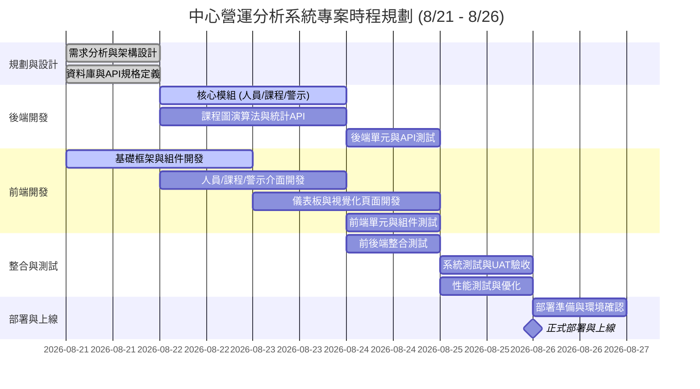
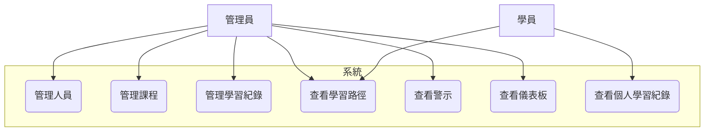
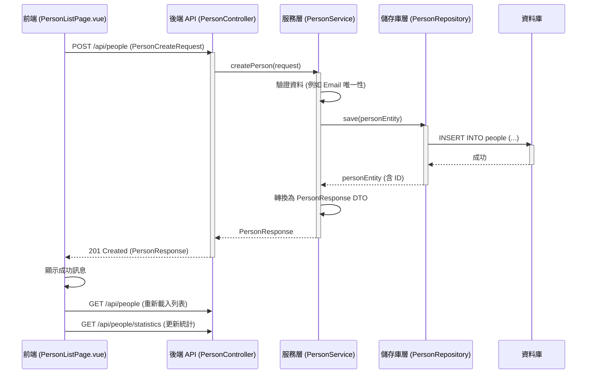
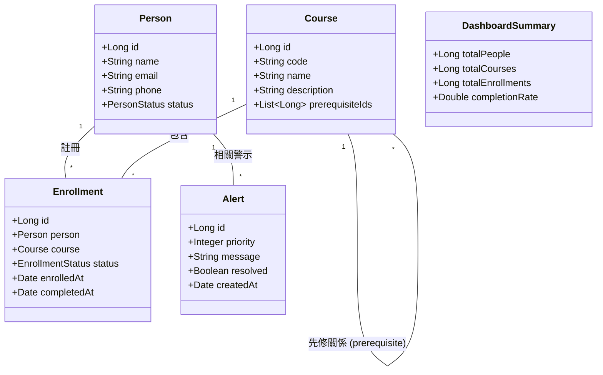
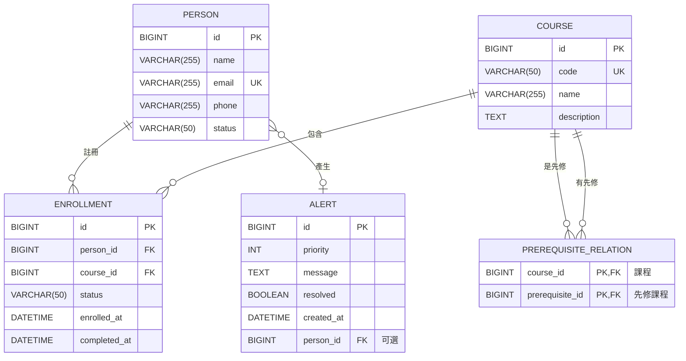
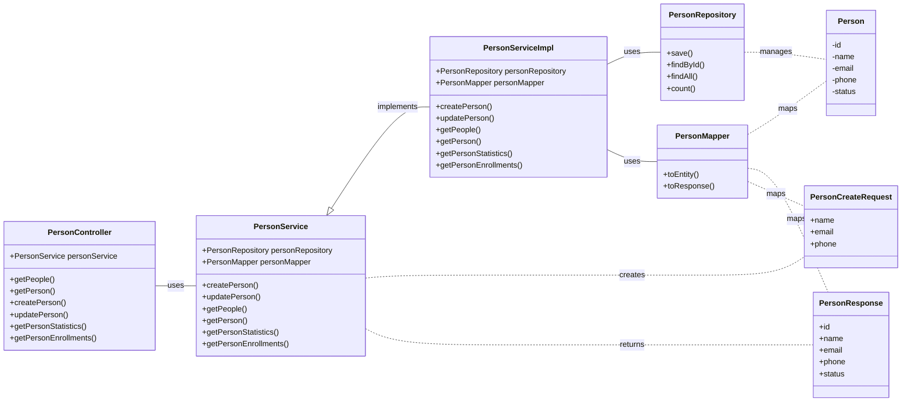
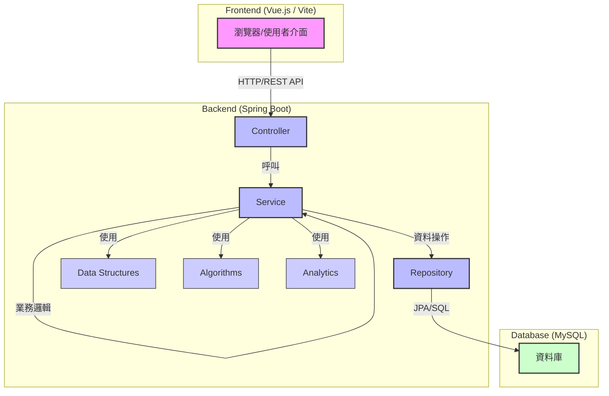
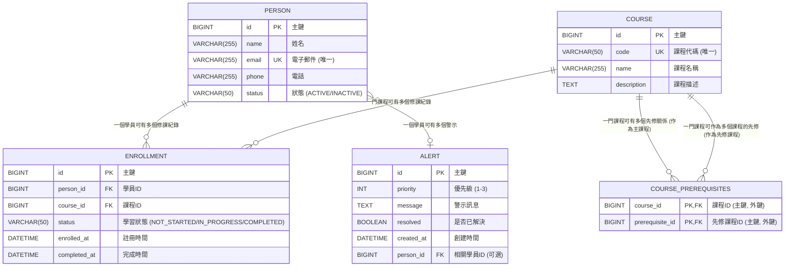

# 中心營運分析系統 - 規格需求說明文件

## 1. 專案說明

本專案旨在建立一個「中心營運分析系統」，提供人員、課程、學習紀錄、課程學習路徑、警示及儀表板等管理與分析功能。系統採用現代化的前後端分離架構，後端基於 Spring Boot 提供 RESTful API 服務，前端則使用 Vue.js 構建互動式使用者介面。專案特別強調資料結構與演算法的應用，以支援複雜的課程先修關係管理和學習路徑規劃。

**主要功能模組：**
*   **人員管理：** 建立、查詢、修改學員資料，並提供學員統計數據。
*   **學習紀錄：** 管理學員的課程註冊與學習進度，支援狀態更新與查詢。
*   **課程管理：** 建立、查詢、修改課程資料，並管理課程間的先修關係。
*   **課程學習路徑：** 視覺化課程圖，並提供基於拓樸排序的建議修課順序。
*   **警示頁面：** 顯示系統生成的各類警示，支援優先級篩選。
*   **儀表板：** 提供系統概覽數據，如總學員數、總課程數、總修課數及完成率。

## 2. 技術規格

*   **後端框架：** Spring Boot 4.1.0
*   **程式語言：** Java 21
*   **建置工具：** Apache Maven
*   **資料庫：** MySQL (透過 `mysql-connector-j`)
*   **ORM 框架：** Spring Data JPA, Hibernate ORM
*   **Web 框架：** Spring WebMVC
*   **驗證：** Jakarta Validation
*   **依賴注入：** Spring IoC
*   **開發工具：** Lombok (簡化 Java Bean 開發)
*   **前端框架：** Vue.js 3
*   **前端建置工具：** Vite
*   **前端語言：** JavaScript
*   **狀態管理：** Pinia (Vue.js 狀態管理庫)
*   **圖表繪製：** Mermaid (用於文件中的圖表)
*   **版本控制：** Git

## 3. 專案時程規劃

以下為一個假設的專案時程規劃，實際時程需根據資源與進度調整。

## 4. 需求分析

### 4.1. 人員管理

*   **功能：** 查詢、新增、修改學員資料。
*   **API 規格：**
    *   `GET /api/people`: 分頁查詢所有人員，支援 `page`, `status` (ACTIVE/INACTIVE), `search` (姓名或 Email 部分比對) 參數。
    *   `GET /api/people/{id}`: 查詢單一人員詳情。
    *   `POST /api/people`: 新增人員，請求體為 `PersonCreateRequest`。
    *   `PUT /api/people/{id}`: 修改人員資料，請求體為 `PersonUpdateRequest`。
    *   `GET /api/people/statistics`: 查詢人員統計數據 (總數、在學、停用)。
*   **前端行為：**
    *   搜尋或切換狀態後，頁碼重設為 0。
    *   搜尋欄位具備 debounce 功能。
    *   顯示總數、在學及停用人數，這些統計數據獨立於列表的搜尋與篩選。
    *   新增人員時 Email 不可重複。
    *   編輯人員時 Email 不可修改。

### 4.2. 學習紀錄

*   **功能：** 查詢學員的修課紀錄，更新學習狀態。
*   **API 規格：**
    *   `GET /api/people/{personId}/enrollments`: 分頁查詢指定學員的修課紀錄，支援 `page`, `sort` (目前只支援 `courseName`), `direction` (asc/desc) 參數。
    *   `POST /api/enrollments`: 註冊課程，請求體為 `EnrollmentCreateRequest`。
    *   `PUT /api/enrollments/{id}`: 更新學習狀態，請求體為 `{ status: "COMPLETED" }`。
*   **前端行為：**
    *   切換排序後，頁碼重設為 0。
    *   `COMPLETED` 狀態的紀錄，其狀態選單必須禁用，並提供不可修改的提示。
    *   保留 API 錯誤處理。

### 4.3. 課程管理

*   **功能：** 查詢、新增、修改課程資料，管理課程先修關係。
*   **API 規格：**
    *   `GET /api/courses`: 分頁查詢所有課程，支援 `page`, `search` (課程代碼或名稱部分比對) 參數。
    *   `POST /api/courses`: 新增課程，請求體為 `CourseCreateRequest`。
    *   `PUT /api/courses/{id}`: 修改課程資料，請求體為 `CourseUpdateRequest`。
    *   `POST /api/courses/{courseId}/prerequisites`: 建立課程先修關係，請求體為 `{ prerequisiteId: Long }`。
    *   `DELETE /api/courses/{courseId}/prerequisites/{prerequisiteId}`: 移除課程先修關係。
    *   `GET /api/courses/{courseId}/available-prerequisites`: 查詢指定課程可用的先修課程候選列表 (排除自己、已存在關係、會形成 Cycle 的課程)。
    *   `GET /api/courses/options`: 查詢不分頁的輕量課程資料，用於下拉選單。
*   **前端行為：**
    *   搜尋後，頁碼重設為 0。
    *   顯示 `CourseResponse.prerequisiteIds`。
    *   新增先修課程時，使用 `GET /api/courses/{courseId}/available-prerequisites` 取得安全候選。
    *   成功新增或移除先修關係後，重新查詢課程資料。
    *   移除先修關係時呼叫 `DELETE` API，不可只在前端本地移除。
    *   不再使用 `size=500` 假裝取得全部課程，改用 `GET /api/courses/options`。

### 4.4. 課程學習路徑

*   **功能：** 視覺化課程圖，顯示建議修課順序。
*   **API 規格：**
    *   `GET /api/courses/learning-path`: 獲取課程圖的節點 (`nodes`)、邊 (`edges`) 和拓樸排序 (`topologicalOrder`)。
*   **前端行為：**
    *   下拉選單使用 `GET /api/courses/options`。
    *   配合新的 Graph Response 格式 (`nodes`, `edges`, `topologicalOrder`) 進行渲染。
    *   不可用連續箭頭暗示拓樸排序中相鄰課程具有直接先修關係。
    *   若保留線性清單，標題改為「一組可行的建議修課順序」。

### 4.5. 警示頁面

*   **功能：** 查詢系統生成的警示，支援優先級篩選。
*   **API 規格：**
    *   `GET /api/alerts`: 分頁查詢所有警示，支援 `page`, `priority` (3/2/1) 參數。
*   **前端行為：**
    *   篩選使用 `priority=3|2|1`。
    *   選擇「全部」時，完全不傳遞 `priority` 參數。
    *   切換優先級後，頁碼重設為 0。
    *   不可只過濾目前頁面的資料。

### 4.6. 儀表板

*   **功能：** 顯示系統概覽數據。
*   **API 規格：**
    *   `GET /api/dashboard`: 獲取儀表板統計數據 (總學員數、總課程數、總修課數、完成率)。
*   **前端行為：**
    *   顯示總學員數、總課程數、總修課數、完成率。

## 5. 使用者關係案例圖 (Use Case Diagram)

## 6. 循序圖 (Sequence Diagram) - 新增人員

## 7. 高階類別圖 (High-Level Class Diagram)

## 8. ER 圖 (Entity-Relationship Diagram)

## 9. 系統類別設計圖 (System Class Design Diagram)

## 10. 系統架構圖 (System Architecture Diagram)

## 11. 資料庫各表格間的關聯圖 (Database Table Relationship Diagram)

## 12. 資料結構及演算法細部說明

本專案在後端設計中，特別引入了多種資料結構與演算法，以高效處理複雜的業務邏輯，尤其是課程先修關係和警示管理。

### 12.1. CourseGraph (課程圖)

*   **目的：** 用於表示課程之間的先修關係，並支援圖形演算法（如拓樸排序、循環檢測）。
*   **結構：**
    *   **節點 (Nodes)：** 代表課程 (Course)。每個節點包含課程 ID、代碼和名稱。
    *   **邊 (Edges)：** 代表先修關係。邊的方向固定為「先修課程 → 依賴它的課程」。例如，如果課程 A 是課程 B 的先修，則存在一條從 A 指向 B 的邊。
    *   **內部表示：** 通常使用鄰接列表 (Adjacency List) 來儲存圖。例如，`Map<Long, List<Long>> adjacencyList`，其中 Key 是課程 ID，Value 是其直接後續課程的 ID 列表。
*   **應用場景：**
    *   **拓樸排序 (Topological Sort)：** 根據課程的先修關係，生成一個可行的修課順序。這對於規劃學員的學習路徑至關重要。
    *   **循環檢測 (Cycle Detection)：** 在新增先修關係時，檢測是否會形成循環依賴（例如 A → B → C → A），避免無效的課程設計。
    *   **可用先修課程查詢：** 根據當前課程，排除已是其先修、會形成循環，或課程本身，來提供可選的先修課程列表。
*   **演算法關聯：**
    *   **拓樸排序：** 可基於深度優先搜尋 (DFS) 或 Kahn's Algorithm 實現。
    *   **循環檢測：** 可在 DFS 過程中通過追蹤訪問狀態（未訪問、訪問中、已訪問）來實現。

### 12.2. MaxHeap (最大堆積)

*   **目的：** 用於高效地管理和排序具有優先級的警示 (Alert)，確保最高優先級的警示總是被優先處理。
*   **結構：**
    *   一個完全二元樹，其中每個父節點的值都大於或等於其子節點的值。
    *   通常使用陣列來實現，節點的索引關係為：左子節點 `2i+1`，右子節點 `2i+2`，父節點 `(i-1)/2`。
*   **應用場景：**
    *   **警示排序：** 警示生成後，根據其 `priority` 屬性插入到最大堆積中。
    *   **獲取最高優先級警示：** 堆頂元素始終是優先級最高的警示，可以在 O(1) 時間內獲取。
    *   **移除警示：** 移除堆頂元素後，需要進行堆化 (heapify) 操作，以維持堆的性質，時間複雜度為 O(log N)。
*   **演算法關聯：**
    *   **插入 (Insert)：** 將新元素添加到堆的末尾，然後向上調整 (heapify-up) 以恢復堆的性質。
    *   **刪除最大元素 (Extract Max)：** 移除堆頂元素，將堆的最後一個元素移到堆頂，然後向下調整 (heapify-down) 以恢復堆的性質。

### 12.3. CustomHashTable (自訂雜湊表)

*   **目的：** 提供高效的鍵值對儲存和檢索，可能用於特定場景下的快速查找，例如緩存或特定 ID 到物件的映射。
*   **結構：**
    *   由一個陣列和一個雜湊函數組成。雜湊函數將鍵映射到陣列的索引。
    *   **衝突解決：** 當多個鍵映射到同一個索引時，需要解決衝突。常見方法有鏈地址法 (Chaining) 或開放定址法 (Open Addressing)。
*   **應用場景：**
    *   快速查找：例如，根據課程代碼快速查找課程物件，或根據 Email 快速查找人員物件。
    *   緩存：儲存頻繁訪問的數據，減少資料庫查詢。
*   **性能：** 在理想情況下，平均時間複雜度為 O(1) 進行插入、刪除和查找。最壞情況下可能退化為 O(N)。

### 12.4. 其他演算法

*   **BFS (廣度優先搜尋) / DFS (深度優先搜尋)：**
    *   **目的：** 遍歷圖或樹的節點。
    *   **應用：** 在 `CourseGraph` 中，可用於查找從某門課程可達的所有課程，或檢測兩門課程之間是否存在路徑。
*   **Topological Sort (拓樸排序)：**
    *   **目的：** 對有向無環圖 (DAG) 的節點進行線性排序，使得對於每條有向邊 U → V，U 都出現在 V 之前。
    *   **應用：** 在 `CourseGraph` 中，用於生成學員的建議修課順序。
*   **Merge Sort (合併排序)：**
    *   **目的：** 一種高效的比較排序演算法。
    *   **應用：** 可能用於對大型列表進行排序，例如在某些報表生成或數據處理環節中。其時間複雜度為 O(N log N)，穩定且適用於外部排序。

## 13. 測試案例

本專案的測試策略涵蓋單元測試、整合測試和 API 測試，確保各模組功能正確、資料結構行為符合預期、前後端整合順暢。

### 13.1. 單元測試 (Unit Test)

*   **Service 層測試：**
    *   **PersonService：**
        *   新增人員成功、Email 重複時拋出異常。
        *   查詢不存在人員時拋出 `ResourceNotFoundException`。
        *   姓名/Email 搜尋、狀態篩選結果正確，分頁 metadata 正確。
        *   人員統計滿足 `total = active + inactive`，且不受搜尋/篩選影響。
    *   **CourseService：**
        *   建立課程、查詢課程、重複課程代碼處理。
        *   禁止將自己設為先修課程、禁止先修關係形成循環。
        *   課程代碼/名稱搜尋在分頁前套用。
        *   `CourseResponse` 正確回傳 `prerequisiteIds`。
        *   新增/刪除先修關係後，資料庫與查詢結果一致。
        *   可用先修課程排除自己、既有關係與會形成循環的課程。
        *   查詢候選後新增關係時仍再次執行循環驗證。
    *   **EnrollmentService：**
        *   正常註冊、重複註冊處理。
        *   狀態更新、完成課程時寫入日期。
        *   禁止學習狀態倒退、`COMPLETED` 紀錄不可再次修改。
        *   依課程名稱升序/降序排序後再分頁。
    *   **AlertService：**
        *   未提供 priority 時依 `priority DESC, createdAt ASC` 查詢。
        *   priority 篩選結果與分頁 metadata 正確。
        *   Alert Generator 依 Enrollment status 與 start date 產生正確 priority。
        *   `COMPLETED` 不產生警示。
*   **資料結構測試：**
    *   **CustomHashTable：** 插入、衝突處理、移除。
    *   **CourseGraph：**
        *   添加邊：A → B，確認 B 出現在 A 的鄰接列表。
        *   循環檢測：A → B → C → A，確認能檢測出循環。
        *   拓樸排序：分支圖可產生合法順序，不相連節點包含在結果中。
        *   `nodes`、`edges`、`topologicalOrder` 的 ID 互相對應。
    *   **MaxHeap：** 插入、移除最大元素，維持堆的性質。
*   **演算法測試：**
    *   **MergeSort：** 空集合、單筆資料、已排序資料、亂序資料的排序。
    *   **Topological Sort：** 正常排序、循環時拋出異常。

### 13.2. 整合測試 (Integration Test)

*   **建立學員：** `POST /api/people` → `GET /api/people`，確認資料存在。
*   **課程註冊：** 建立人員 → 建立課程 → 註冊課程 → 查詢修課紀錄，確認關係正確。
*   **Graph 分析：** 課程資料 → `CourseGraph` → 拓樸排序 → `GET /api/courses/learning-path`，確認學習路徑正確。
*   **人員查詢與統計：** 建立 ACTIVE/INACTIVE 人員 → 搜尋/篩選 → 檢查 `PageResponse` → `GET /api/people/statistics`，確認列表條件只影響列表結果，統計反映全域資料。
*   **警示產生與篩選：** 建立不同狀態與開始日期的 Enrollment → Alert Generator → MaxHeap 排序 → `GET /api/alerts?priority=3`，確認責任分離且篩選後分頁 metadata 正確。
*   **儀表板：** Enrollment 資料 → Analytics → `GET /api/dashboard`，確認統計正確。

### 13.3. API 測試 (Postman/Swagger)

*   **成功案例：**
    *   `POST /api/courses` 成功回傳 `201 CREATED`。
*   **驗證錯誤：**
    *   空名稱或非法 Email 提交時，回傳 `400 BAD REQUEST`。
*   **資源未找到：**
    *   查詢不存在的 ID 時，回傳 `404 NOT FOUND`。
*   **衝突錯誤：**
    *   Email 重複、非法狀態轉換、先修關係形成循環時，回傳 `409 CONFLICT`。
